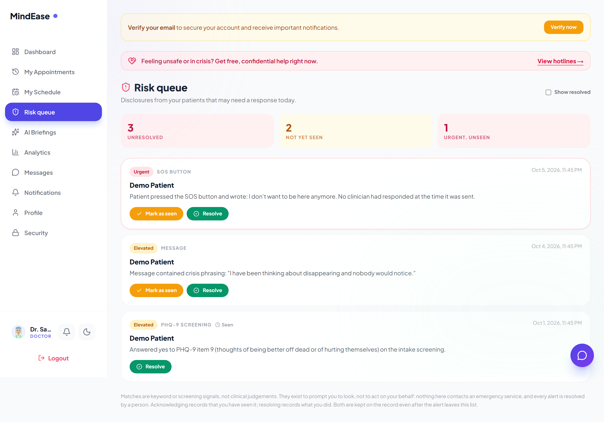
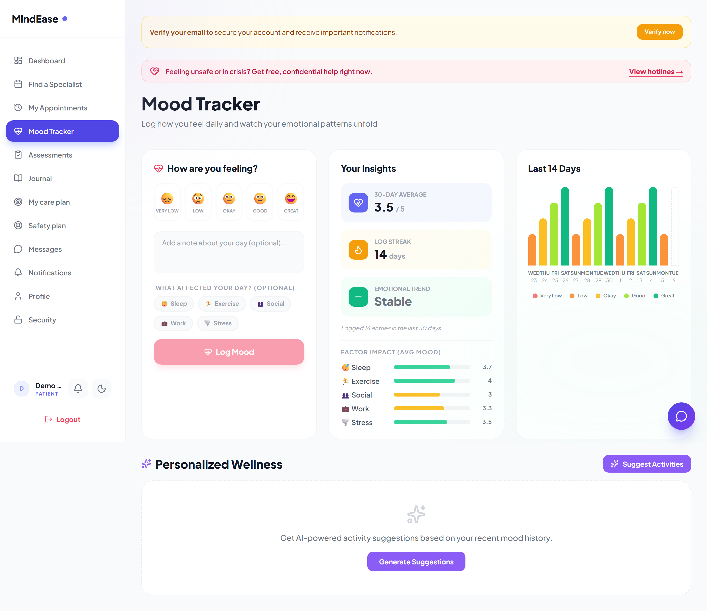
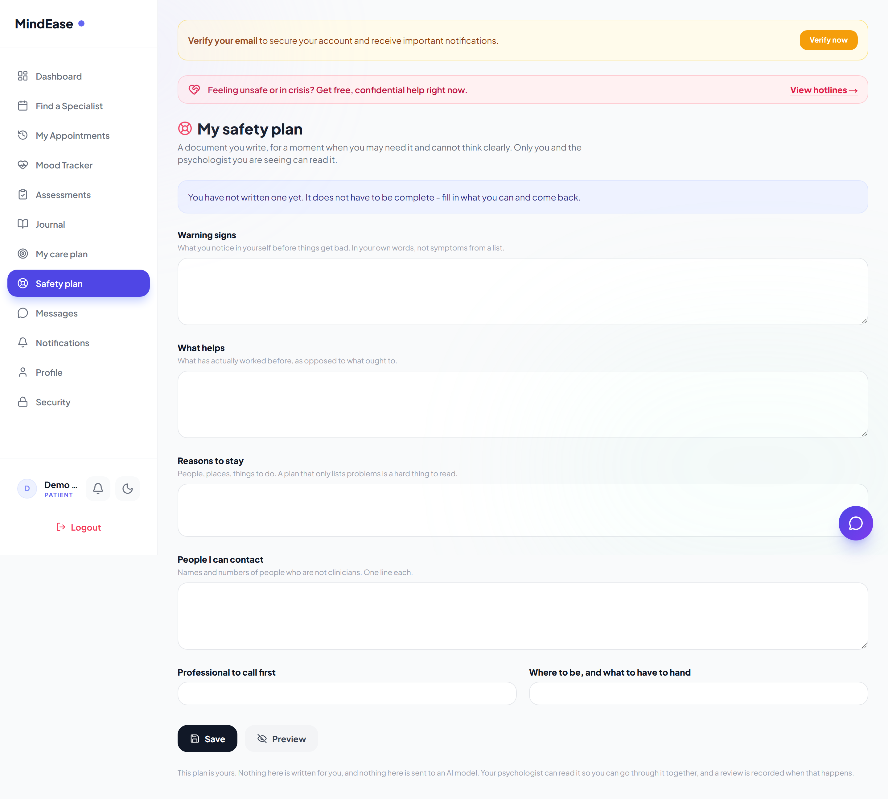
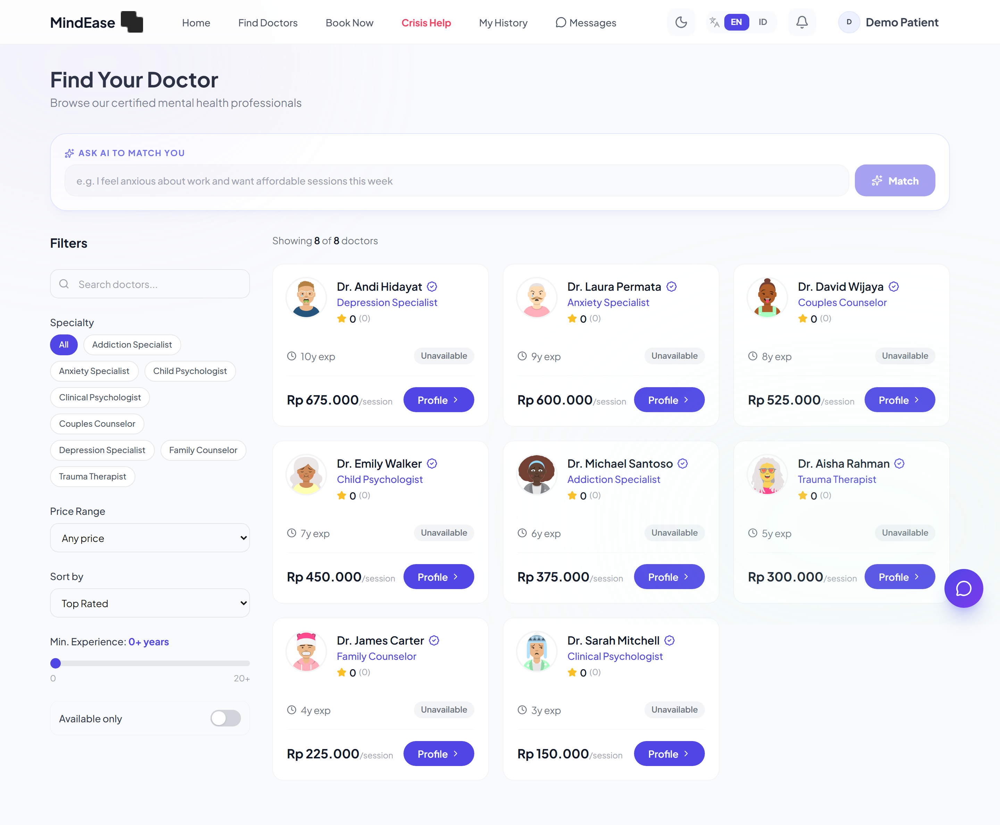
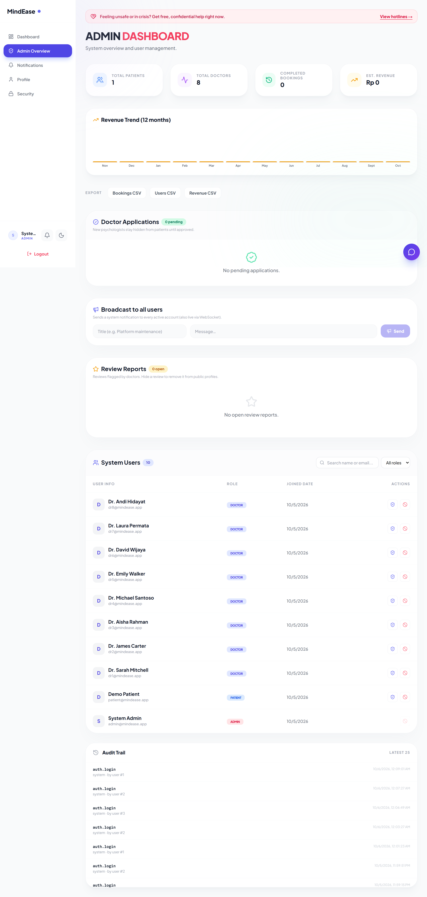
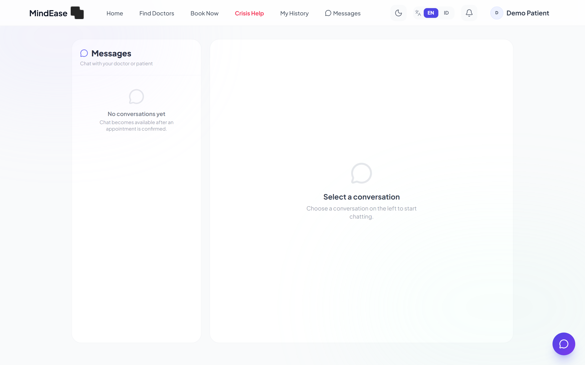
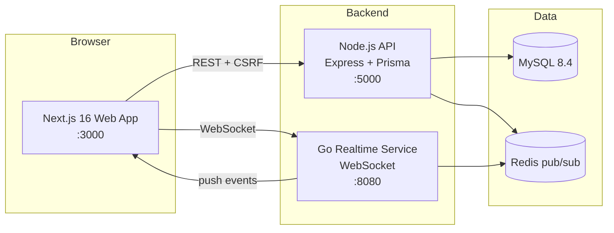

# MindEase

**A mental-health telehealth platform where a disclosure of thoughts of self-harm
reaches a named clinician, and the code says out loud when it cannot.**

Booking, in-browser video, longitudinal clinical records, an admin console, and
a triage queue for risk disclosures. Next.js 16, Express, Prisma/MySQL, and a Go
WebSocket service.

[](https://github.com/davinakmalyasha/MindEase/actions/workflows/ci.yml)
[](LICENSE)
[](server/package.json)
[](client/package.json)
[](server/prisma/schema.prisma)
[](server-realtime/)
[](CONTRIBUTING.md)
[](SECURITY.md)


---

## The screens

Captured from a running, seeded instance by `client/scripts/screenshots.js` —
not mockups. The screenshot script logs in as each of the three roles and checks
every route it visits still exists in `client/app/`, so a renamed page fails
loudly here instead of producing a broken image in this file.

| | |
|---|---|
|  |  |
| **Risk queue.** Every row is a disclosure that reached a person. "Mark as seen" and "Resolve" are separate acts and the resolution records who did what. | **Mood tracker.** Fourteen days of history with an explicit insufficient-data state, and a text equivalent of the chart for anyone who cannot read the bars. |
|  |  |
| **Safety plan.** Written by the patient, never generated by a model. | **Clinician directory.** Availability is the clinician's own statement, and its absence is labelled rather than filled in. |
|  |  |
| **Admin console.** | **Messages.** A crisis phrase raises an alert for a human; nothing here contacts an emergency service. |

The full set, with a caption each, is in
[docs/screenshots/](docs/screenshots/README.md).

---

## The part I would talk about in an interview

Most telehealth demos stop at "the patient booked a slot". Three things here go
further, and each is a decision rather than a feature.

**A disclosure of thoughts of self-harm becomes someone's job.** A non-zero
answer to PHQ-9 item 9, the SOS button, or crisis phrasing in a
patient-to-clinician message becomes a row in a worklist a named clinician
works — with acknowledging and resolving as separate acts, so an alert picked up
on Monday and still owed an outcome on Friday doesn't look identical to one
nobody has seen. Resolution records who did what, and the row is kept.

**It never escalates on its own.** A crisis phrase prompts a human. There is no
code path from a patient's message to an external service, and
[ADR-0002](docs/adr/0002-ai-provenance.md) records why adding one is a product
decision rather than a feature. Keyword matching is a prompt to look, not a
triage system, and the footer of the queue screen says so in those words.

**The UI is not allowed to invent a clinical claim.** A clinician with no
reviews has a rating of `0`, not a flattering default. An unstated availability
renders as "not published" — the profile page used to show every clinician
`Mon – Fri 09:00–17:00` because the API never selected the field, which is a
fabricated commitment from a person, about a person. Untranslated strings, raw
API slugs, and dates formatted in whatever locale the browser had are all bugs;
[`client/tests/doctor-mapping.test.ts`](client/tests/doctor-mapping.test.ts)
exists mostly to keep them fixed.

## Four gates that are not a test suite

Most of the unusual shape of this code follows from four checks that fail the
build. [CONTRIBUTING.md](CONTRIBUTING.md) has the commands.

| Gate | What it caught |
|---|---|
| **Schema drift is a build failure.** The database is built from committed migrations; if it and the datamodel disagree by one column, the build fails. | `RiskAlert.resolvedById` — declared, written by the service, created by no migration. The triage queue threw a `PrismaClientValidationError` against any properly built database, and survived because the suite had never been run against one. |
| **Controllers may not derive an HTTP status from a message string.** `tests/error-status.test.ts` scans `src/` and fails on a bare `new Error` whose text becomes a status code. | The class of bug where a Prisma error message shape change turns a 400 into a 500 with a stack trace in the body. |
| **The realtime contract is checked across three languages.** One test compares the TypeScript event union against the Go JSON tags, the Go `criticalTypes` map and the client fan-out, in both directions. | Drift between three implementations of one contract. It found five event types in the Go table that **nothing publishes**, while `sos:alert` and `risk:alert` — the two events that service exists to deliver — were classified as droppable-and-cosmetic, so the counters built to surface lost clinical alerts reported them as routine. |
| **Documented numbers are checked against the tree.** `scripts/check-numbers.js` re-derives every count quoted in the documentation and fails the build on a disagreement. | Fifteen counts that drifted after a previous pass corrected them all: a stale test count in two CI comments, a per-file table summing to 415 under a heading that said 427, a Prisma badge reading 6.2 against a manifest pinning 6.12. |

## What it does

| | |
|---|---|
| **Clinical safety** | A clinician triage queue with acknowledge/resolve transitions, an audit trail, and no automatic escalation. A patient-owned care plan (goals and steps, `dropped` as well as `achieved`) and a patient-written safety plan that is never generated by a model. |
| **Consultations** | In-browser video and voice. The server mints a short-lived, room-scoped, participant-bound token, so a link is not sufficient to join. The room opens 15 minutes early and closes an hour after. Follow-up scheduling and `.ics` export. |
| **Longitudinal records** | PHQ-9 and GAD-7 with a scored trajectory and an explicit `insufficient-data` state rather than a confident verdict from two data points. Mood trends, 30-day averages, streaks, and journal summaries. |
| **Access transparency** | Clinician profiles show real availability patterns, licence details, and credentials — labelled as the clinician's own statement, and equally clear when they have stated nothing. |
| **AI with provenance as a type** | `AiResult` carries `source` and `degradedReason`, so a degraded response cannot be rendered as a real one without ignoring the type. Circuit breaker, bounded timeouts, and a per-process random fence nonce around every untrusted block in a prompt. |
| **Booking** | Slot integrity, waitlists, away mode, recurring availability patterns, referral credits, therapy packages, and Midtrans checkout behind a provider abstraction. |
| **Accounts** | Argon2id, TOTP 2FA with a replay guard, hashed rotating refresh tokens, CSRF double-submit, account export and anonymising deletion. |

## Scale

Numbers measured from the tree, not estimated.

| | |
|---|---|
| **44,911** | lines of TypeScript, SQL and Go — 33,079 application, 10,012 tests, 1,091 migration SQL, 729 Go |
| **126** | API routes · **28** Prisma models · **17** migrations |
| **498** | server tests across 40 files, against a real MySQL and real Argon2 |
| **49** | client unit tests · **32** Go tests with `-race` · **12** Playwright journeys |
| **10** | ADRs and design documents · **5** services in compose |

Every figure above is measured, not estimated. `make numbers` re-derives them and
exits non-zero if any disagrees with what is written here.

**Also worth reading:** [ENGINEERING-NOTES.md](ENGINEERING-NOTES.md) — the two
bugs this repository's own clinical safety path contained, how a 400-test suite
missed both, and which parts of the design I still do not believe.

## Quick start

**What you need first.** `make` is the entry point for everything below and it is
not the only prerequisite, which used to be unstated:

| | |
|---|---|
| **git**, **GNU make** | every target runs through `make` |
| **A POSIX shell** | every recipe runs under `/bin/bash`, so on Windows that means Git Bash or WSL |
| **Node 22** | see `.nvmrc`; both services and both Dockerfiles pin 22 |
| **Go 1.26** | only for the realtime service |
| **Docker + Compose ≥ 2.17** | for `make up` and `make e2e`. `>= 2.17` is what `--wait` needs |
| **MySQL 8** and **a free port** | only if you are not using compose. Five ports are published: 3000, 5000, 8080, 3306, 6379 |
| **~2 GB of RAM** | three images plus a database |
| **An OpenSSL-style RNG** | `openssl rand -base64 48`, three times, for the signing secrets |

If any of that is missing, `make doctor` says which — and `make setup` runs it for
you at the end.

```bash
git clone https://github.com/davinakmalyasha/MindEase
cd MindEase
make setup     # install both Node services and create the env files
make up        # build and boot the stack, then seed it
```

`make up` seeds the database, so the demo accounts below actually exist — which
they did not for most of this repository's life, because neither compose nor CI
had a seed step.

Then open **http://localhost:3000**. `make help` lists everything else.

> `make up` runs the payment simulator, which settles any order from an unsigned
> POST. That is a local-development convenience and it is set by `make up`
> specifically, not by a default in `docker-compose.yml`, so copying the compose
> file into a real environment cannot ship it.

### Project layout

```
MindEase/
├─ server/              Express 5 + Prisma + MySQL. The API.
│  ├─ prisma/
│  │  ├─ schema.prisma  28 models, no enums — every status is a String
│  │  └─ migrations/    17 hand-written MySQL migrations, all backticked
│  ├─ src/
│  │  ├─ routes/        126 router registrations across 17 files
│  │  ├─ services/      the domain; the only layer that touches Prisma
│  │  ├─ controllers/   HTTP shape only
│  │  ├─ middleware/    auth, roles, CSRF, rate limits
│  │  ├─ schemas/       zod, and the generated OpenAPI document
│  │  ├─ jobs/          three cron jobs, all single-runner gated
│  │  └─ lib/           tokens, cache, storage, payments, logging
│  └─ tests/            498 integration tests against a real database
├─ client/              Next.js 16 App Router, React 19, next-intl
│  ├─ app/              37 routes; every authenticated one is a client component
│  ├─ components/       53 components
│  ├─ hooks/queries/    TanStack Query — the house data-fetching pattern
│  ├─ messages/         en.json and id.json, kept in parity by a test
│  ├─ e2e/              12 Playwright journeys
│  └─ tests/            46 unit tests
├─ server-realtime/     Go WebSocket hub. 31 tests with -race.
├─ docs/                architecture, data model, operations, testing, roadmap
│  ├─ adr/              four records of decisions and what was rejected
│  └─ roadmap.md        including what will never be built, and why
├─ scripts/             the repository's own gates; see below
├─ .github/workflows/   ci, cd, security — 18 jobs
└─ Makefile             `make help`
```

### The repository checks its own prose

`scripts/` holds the gates that run in CI and can be run by hand:

| Script | What it fails on |
|---|---|
| `check-numbers.js` | a documented count disagreeing with the tree. Exits **2** when an anchor stops matching, because a document that quietly stopped being checked is worse than one with a wrong number |
| `check-encoding.js` | mojibake — the fingerprint of a bulk text repair run through a console codepage. Caught three times here, once inside `schema.prisma` |
| `check-migration-case.js` | a migration whose table casing resolves on Windows and fails on Linux |
| `check-workflows.js` | a job without permissions or a timeout, a `needs:` that resolves to nothing, an unpinned action, a secret interpolated into a script |
| `check-csp.js` | a malformed `Content-Security-Policy`, or one that does not permit the API the app is configured to call |
| `check-i18n.js` | a `t("key")` that resolves in no locale. next-intl throws on those, so a missing message is a page that will not render, not a blank label |
| `check-a11y-ids.js` | a duplicate `id`, a label with no `id`, and two labels sharing one `htmlFor` |
| `check-schema-indexes.js` | a foreign-key column with no index and no written reason. InnoDB creates one for every FK, so those are not slow queries — which is exactly why they read as an oversight |
| `check-a11y.js` | a `<button>` with no accessible name, a form error rendered without `role="alert"`, and any *new* sub-AA text colour |

Each of the last five has a `.test.js` beside it that pins the rules against
policies, key sets and markup written by hand — including the specific broken
intermediate each one was written to catch. A gate with no test proving it can
still fail is a comment.

Plus two maintenance tools: `pin-actions.js` rewrites every `uses:` to a commit
SHA, and `setup-env.js` generates the local signing secrets and checks that the
API and the web app agree on one (`make doctor` runs the check).

Every count in this file is produced by `make numbers`, which prints the measured
values and exits non-zero if any of them disagrees with what is written here.

<details>
<summary>Running the three services without Docker</summary>

Needs MySQL 8 and Redis 7 already running, plus `server/.env` and
`client/.env.local` — see [docs/operations.md](docs/operations.md).

```bash
make db        # or bring up MySQL and Redis yourself
make dev-db    # migrate and seed
make dev       # API, realtime and web together
```

</details>

<details>
<summary>Demo accounts (created by <code>make up</code>)</summary>

| Role | Email | Password |
|---|---|---|
| Patient | `patient@mindease.app` | `Patient@123` |
| Clinician ×8 | `dr1@mindease.app` … `dr8@mindease.app` | `Doctor@123` |
| Admin | `admin@mindease.app` | `Admin@123` |

The seed creates no reviews on purpose. It used to invent 4.2–4.9 ratings for
clinicians with none, which made "Top Rated" rank the most-liked-*looking*
profiles first. Review Journey 10 in the e2e suite builds its own review so the
lifecycle is genuinely tested rather than seeded.

</details>

## Testing

```bash
make check      # typecheck, lint, go vet, encoding guard - no database needed
make test       # 498 server tests against a freshly migrated database
make test-all   # server, client and Go
make verify     # everything above plus the drift gate, in the order CI runs it
```

The server suite is integration-only: a real MySQL, real Argon2, real cookies.
SQLite is not an option — the provider is a literal `mysql` and all 17 migrations
are raw MySQL DDL.

Coverage is available (`make -C server coverage`, `make -C client coverage`) but
**not enforced**, and the number is low: the client sits at 2% of statements with
77% branch coverage, because four test files cover `lib/` and 91 app and
component files are untested. That gap is tracked in
[docs/roadmap.md](docs/roadmap.md) rather than hidden behind a threshold nobody
has read.

## Documentation

| | |
|---|---|
| [ARCHITECTURE.md](ARCHITECTURE.md) | How the services fit together, and the reasoning behind the layering |
| [ENGINEERING-NOTES.md](ENGINEERING-NOTES.md) | What was wrong in this repository, how it was found, and what I still do not believe |
| [docs/security.md](docs/security.md) | Threat model, what is deliberately not protected, and the controls that carry the weight |
| [docs/data-model.md](docs/data-model.md) | 28 models, an ER diagram, and the decisions that are not obvious from the schema |
| [docs/testing.md](docs/testing.md) | The gates, all 36 server test files, and how to add a test |
| [docs/operations.md](docs/operations.md) | Runbook: backup, secret rotation, rollback, troubleshooting |
| [docs/glossary.md](docs/glossary.md) | The domain terms the code uses without defining |
| [docs/roadmap.md](docs/roadmap.md) | Direction, including what is deliberately not planned |
| [docs/adr/](docs/adr/) | Why the realtime service, the provenance type, and the payment abstraction are shaped as they are |
| [SECURITY.md](SECURITY.md) · [CONTRIBUTING.md](CONTRIBUTING.md) · [CHANGELOG.md](CHANGELOG.md) | |

## Architecture



- **Web**: Next.js 16 (App Router), React 19, TanStack Query, Tailwind, next-intl (EN/ID), dark mode
- **API**: Express 5 + TypeScript, Prisma ORM, Zod validation, JWT rotation, CSRF, rate limiting, audit logs, pino logging, health checks
- **Realtime**: Go microservice (`server-realtime/`) — WebSocket hub consuming Redis pub/sub events pushed by the API
- **Auth**: email/password (Argon2), Google SSO, email verification, TOTP 2FA, login lockout, refresh-token rotation
- **AI**: Gemini 2.0 Flash — pre-session questions, doctor briefings, wellness suggestions, journal reflections, natural-language doctor matching, support chat. Every call reports whether a model answered, and the UI says so
- **Consultations**: in-app video/voice rooms. The server mints a short-lived, room-scoped access token; only the appointment's patient and clinician can obtain one, the room opens 15 minutes early and closes an hour after, and follow-up scheduling plus `.ics` export are supported
- **Clinical safety**: a clinician **risk queue** collecting disclosures from PHQ-9 item 9, the SOS button, and crisis phrasing in a patient-to-clinician message — with acknowledge/resolve transitions and an audit trail. A fourth signal, a sustained mood decline, is detected daily and does prompt the patient directly, but it does not yet reach the clinician's queue; `RiskAlert.sourceType` reserves `"mood"` for it. Matches are keyword or screening signals that prompt a human; nothing escalates automatically
- **Longitudinal records**: a **care plan** owned by the patient (goals and steps, `dropped` as well as `achieved`) and a patient-written **safety plan**. Neither is ever generated by a model
- **Screening**: PHQ-9 & GAD-7 with severity scoring, plotted as a trajectory, printable, and surfaced in the doctor's briefing. Screening instruments, not diagnoses
- **Access transparency**: a clinician's stated licence number, issuer, education, languages and real published availability are shown on their public profile, and the "verified" badge is labelled for what it is — an administrative review of submitted information, not a check against a licensing board
- **Wellness**: mood logging with factor tags and correlation stats, private journal with AI weekly reflections, opt-in Monday email report, automated care check-ins
- **Support**: "Ease", an AI support assistant that routes crisis phrasing to emergency hotlines and hands off to a support email address
- **Growth**: referral program (invite codes, credit on first completed session), therapy packages with the payment simulator
- **Notifications**: per-category × per-channel preferences, web push (PWA) via VAPID
- **Trust**: doctor verification workflow (profiles hidden until admin approval), doctor replies to reviews, admin review moderation, transactional emails + appointment reminders, waitlist, away mode

See [ARCHITECTURE.md](ARCHITECTURE.md) for the design and
[docs/adr](docs/adr/) for the decisions and the alternatives that were rejected.


## Environment reference

| Variable | Where | Purpose |
|---|---|---|
| `DATABASE_URL` | server/.env | MySQL connection |
| `JWT_SECRET` | server/.env, client/.env.local, compose | Access tokens **and** WebSocket tickets |
| `REFRESH_SECRET` | server/.env | Refresh tokens (7d) — **must differ from `JWT_SECRET`** |
| `TWO_FACTOR_SECRET` | server/.env, compose | Pending 2FA tickets (5m) — **required in production**, must differ from `JWT_SECRET` |
| `GEMINI_API_KEY` | server/.env | AI features (falls back to local generation) |
| `GOOGLE_CLIENT_ID` | server/.env | Google SSO |
| `SMTP_HOST/PORT/USER/PASS` | server/.env | Reset/verification/booking/reminder emails (dev: printed to console) |
| `REDIS_URL` | server/.env, compose | Realtime event bus + caching (silently disabled when down) |
| `WA_GATEWAY_URL` / `WA_GATEWAY_TOKEN` | server/.env | Optional WhatsApp appointment reminders (graceful fallback when unset) |
| `PAYMENT_PROVIDER` / `PAYMENT_SERVER_KEY` | server/.env | Package checkout. Unset → in-process simulator (refused in production) |
| `VAPID_PUBLIC_KEY` / `VAPID_PRIVATE_KEY` | server/.env | Optional web push (PWA notifications; no-op when unset) |
| `VIDEO_PROVIDER` | server/.env | `livekit` (authenticated rooms) or `jitsi` (degraded fallback). Defaults to `jitsi` |
| `LIVEKIT_URL` / `LIVEKIT_API_KEY` / `LIVEKIT_API_SECRET` | server/.env | Required for `VIDEO_PROVIDER=livekit`; falls back to jitsi and logs why if any is missing |
| `AI_REQUEST_TIMEOUT_MS` / `AI_CIRCUIT_THRESHOLD` / `AI_CIRCUIT_COOLDOWN_MS` | server/.env | Gemini timeout (20s) and circuit breaker (5 failures / 60s) |
| `ALLOW_PAYMENT_SIMULATOR` | server/.env | Required to run the simulator in production. It hands out free entitlements |
| `CORS_ORIGINS` / `FRONTEND_URL` | server/.env | Allowed browser origins (defaults to localhost:3000) |
| `S3_ENDPOINT/BUCKET/REGION/ACCESS_KEY/SECRET_KEY/PUBLIC_URL` | server/.env | Avatar storage (S3-compatible; local disk fallback in dev) |
| `SENTRY_DSN` | server/.env | Error tracking (no-op when unset) |
| `ALLOWED_ORIGINS` | realtime | Comma-separated websocket origins. `FRONTEND_URL` is added to it |
| `NEXT_PUBLIC_API_URL` / `NEXT_PUBLIC_REALTIME_URL` | client | API + WS endpoints. Inlined at **build** time, so they are docker build args, not runtime env |
| `NEXT_PUBLIC_GOOGLE_CLIENT_ID` | client | Google SSO button (hidden when unset) |
| `NEXT_PUBLIC_SITE_URL` | client | Canonical site URL for SEO/OG metadata |
| `NEXT_PUBLIC_SENTRY_DSN` | client | Client error tracking |

## Deploying

Merge to `main`. `.github/workflows/cd.yml` builds the images, runs
`prisma migrate deploy`, and deploys the API and realtime service to Railway and
the web app to Vercel. The production job is gated on a GitHub `production`
environment that requires approval, so nothing reaches production without a
human accepting the deploy.

First-time setup is still manual — create the Railway projects and add the
secrets listed above. The workflow assumes they exist.

**Production checklist**
- [ ] Real SMTP configured (email flows fail loudly without it)
- [ ] Redis reachable (realtime push + cache active)
- [ ] S3-compatible storage configured (avatars persist across redeploys; Railway's filesystem is ephemeral)
- [ ] Strong, unique `JWT_SECRET` / `REFRESH_SECRET` / `TWO_FACTOR_SECRET` — all three must differ. The server refuses to start in production if any is weak or if they collide, because a shared secret lets a credential minted for one flow verify as another
- [ ] `JWT_SECRET` byte-identical across API, realtime and web
- [ ] Google OAuth client configured with the production domain
- [ ] `VIDEO_PROVIDER=livekit` with all three `LIVEKIT_*` set. On the jitsi fallback a room is an unguessable but unauthenticated URL, and the consultation screen says so before the session starts
- [ ] Backups: Railway MySQL plugin (managed backups) or `server/scripts/backup.ps1`

The reminder and check-in jobs run on `node-cron` inside the API process. They
claim work with a conditional update, so multiple replicas are safe — but the
claim was only fixed to happen *after* the eligibility check, so a session whose
date was in the horizon but whose start time was not would previously have burnt
its own reminder slot.

The server suite runs against a **real MySQL database with real Argon2
hashing**. That is deliberate: a unique-constraint race and a hash round trip
are exactly the properties that cannot be faked, and mocking either makes the
test assert nothing. It is slow, and it wipes the database between tests.

**End-to-end**: `client/e2e/journeys.spec.ts`, 12 tests in 10 journeys, run
against the compose stack. They run on `workflow_dispatch` or on a PR labelled
`e2e` rather than on every push — the suite had never been executed by any
automated process, and reporting a selector failure as a required-check failure
on the first attempt would be the wrong signal. It is promoted to a required
check once green.

```bash
cd client && npx playwright test    # with the stack already running
```

## API documentation

Interactive Swagger UI at `GET /api/docs`, generated from the same Zod schemas
the routes validate with. `server/tests/openapi.test.ts` asserts the spec
matches the registered routes, so a new endpoint without a spec entry fails in
CI. It documents that endpoints exist and what they accept; it does not
document the shape of every response.


## Key endpoints

| Area | Endpoints |
|---|---|
| Auth | `/api/auth/{register,login,google,refresh,logout}`, `/api/account/{forgot-password,reset-password,2fa/*,export,me}` |
| Doctors | `/api/doctors` (paginated, search), `/api/doctors/{id}`, `/api/doctors/slots/*`, `/api/doctors/patterns/*` (weekly availability + regenerate), `/api/doctors/analytics`, `/api/doctors/away`, `/api/doctors/packages/*` |
| Appointments | `/api/appointments/{book,my}`, `/{id}/{status,reschedule,join,ics,follow-up}`, `/{id}/rebook-options`, `/api/follow-ups/{id}/{accept,decline}` |
| Wellness | `/api/wellness/mood*`, `/api/wellness/journal*`, `/api/wellness/assessments*`, `/api/ai/resources` |
| AI | `/api/ai/pre-session*`, `/api/ai/briefing*`, `/api/ai/match-doctors` |
| Clinical safety | `/api/wellness/risk-alerts`, `/api/wellness/risk-alerts/{id}/{acknowledge,resolve}` |
| Care & safety plan | `/api/care-plan*`, `/api/safety-plan`, `/api/safety-plan/patient/{id}*` |
| Support | `/api/support/chat` (AI assistant with crisis routing), `/api/support/sos` (panic button) |
| Messaging | `/api/messages/*` (REST: thread, typing, attachments, delete, reactions) + WebSocket push (typing, read receipts, deleted/reacted) |
| Reviews | `/api/reviews`, `/api/reviews/doctor/{id}`, `/api/reviews/{id}/{reply,report}` |
| Growth | `/api/doctors/{id}/waitlist*`, `/api/doctors/packages/*`, `/api/doctors/packages/{id}/purchase`, `/api/payments/*` |
| Push | `/api/push/{public-key,subscribe,unsubscribe}` |
| Realtime | `/api/realtime/ticket` (short-lived WebSocket ticket) |
| Admin | `/api/admin/{stats,users,audit-logs,doctors/applications,broadcast,review-reports,reviews/:id/hide,export/:kind}` |
| System | `/api/health`, `/api/health/db`, `/api/csrf-token`, `/api/docs` |

## Security features

Argon2 hashing · HttpOnly cookie sessions with rotation · CSRF double-submit
tokens · per-IP + per-account + per-endpoint rate limiting (auth, AI, support) ·
IDOR authorization checks · HTML sanitization · admin audit trail · GDPR account
deletion + data export · TOTP 2FA · email verification · JWT role claims enforced
in middleware · websocket authentication before upgrade, with a token-purpose
gate · websocket origin checks · room-scoped short-lived video tokens ·
fail-fast secret validation in production.

`RiskAlert` rows survive account deletion in anonymised form. The fact that a
patient disclosed thoughts of self-harm and a clinician was paged is clinically
relevant to whoever treats them next, and it contains nothing identifying once
the user is anonymised.

## Known limitations

Stated rather than hidden. Each of these is a decision or a gap, not an accident.

- **Checkout is read-before-create.** Two concurrent checkouts for the same
  package create two orders, and a callback for both grants twice. The fix is a
  unique constraint on in-flight orders, which means a patient cannot buy the
  same package twice until the first settles — a product decision, not a
  technical one. See [ADR-0003](docs/adr/0003-payment-abstraction.md).
- **Sequential integer ids are exposed in API responses.** `prd.md` requires
  UUIDv7 in every external identifier. That is not met; retrofitting it across 27
  models, every route, every cache key and every export is a rewrite.
- **No live payment gateway is configured.** The provider interface and a
  Midtrans implementation are complete and `getPaymentProvider()` selects between
  them, but nothing in this repository carries gateway credentials, so the
  simulator is what actually runs. Pointing it at Midtrans is configuration
  (`PAYMENT_PROVIDER=midtrans` plus a server key), not code.
  See [ADR-0003](docs/adr/0003-payment-abstraction.md).
- **Crisis triage is keyword matching, not understanding.** It over-matches by
  design and does not handle negation or euphemisms. See
  [ADR-0002](docs/adr/0002-ai-provenance.md).
- **Clinical AI briefings are advisory.** The product does not diagnose, and
  nothing in it should be read as doing so. `prd.md` asks for "suggested
  diagnostic routes", which this contradicts — the disclaimer is the position
  taken here.
- **Two large files are deliberately not decomposed.**
  `client/app/dashboard/profile/page.tsx` and `client/components/doctors/DoctorProfile.tsx`
  are each over 600 lines. Low value relative to the regression risk.
- **The e2e suite is opt-in.** It is wired into CI and runs on demand — dispatch
  the workflow, or label a PR `e2e` — rather than on every push, because the
  journeys were written against selectors nothing had ever exercised and a first
  red run would report a selector bug as a regression. It has still never been run
  automatically, and one journey is effectively a smoke test.
- **Two repo guard scripts do not work.** `server/scripts/check-operators.js`
  declares a `CODE_POSITION` regex it never uses and strips only `//` comments,
  so it reports 195 false positives — all of them prose in a doc comment, JSX
  text, or an email template. `check-dependencies.js` does not scan
  `eslint.config.mjs` and so calls the eslint packages unused. Both are wired
  into CI as advisory rather than required, because a required check that fails
  on its first run is worse than an unwired one. Only `check-encoding.js` is
  green and gating.

## CI/CD

`.github/workflows/ci.yml`, five jobs:

- `compose` — validates `docker-compose.yml` (~10s, first, and deliberately so)
- `server` — lint, typecheck, `migrate deploy`, **schema-drift gate**, 498 tests against a MySQL service container
- `client` — lint, 46 tests, production build
- `realtime` — golangci-lint, `go vet`, build, `go test -race -cover`
- `docker` — builds the images, boots the stack, health-checks all five services, seeds, then runs the Playwright journeys when requested

`security.yml` runs weekly as well as on push: gitleaks over the full history,
CodeQL for TypeScript and Go, Trivy on the three Dockerfiles, `npm audit
--audit-level=high`, and `govulncheck`. Every job declares least-privilege
`permissions` and a `timeout-minutes`.

`.github/workflows/cd.yml` deploys on merge to `main` behind an approval gate.

