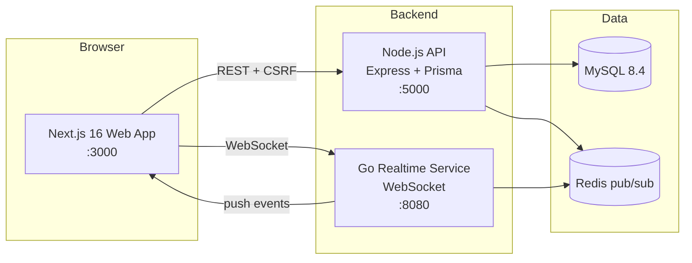

# MindEase — Mental Health Consultation Platform

A mental health telehealth platform connecting patients with psychologists:
appointment booking, in-browser video and voice consultations, longitudinal
clinical records, and an admin console. Built as a portfolio project — see
[Known limitations](#known-limitations) for what is deliberately not built, and
[ARCHITECTURE.md](ARCHITECTURE.md) for how it fits together.

## Architecture



- **Web**: Next.js 16 (App Router), React 19, TanStack Query, Tailwind, next-intl (EN/ID), dark mode
- **API**: Express 5 + TypeScript, Prisma ORM, Zod validation, JWT rotation, CSRF, rate limiting, audit logs, pino logging, health checks
- **Realtime**: Go microservice (`server-realtime/`) — WebSocket hub consuming Redis pub/sub events pushed by the API
- **Auth**: email/password (Argon2), Google SSO, email verification, TOTP 2FA, login lockout, refresh-token rotation
- **AI**: Gemini 2.0 Flash — pre-session questions, doctor briefings, wellness suggestions, journal reflections, natural-language doctor matching, support chat. Every call reports whether a model answered, and the UI says so
- **Consultations**: in-app video/voice rooms. The server mints a short-lived, room-scoped access token; only the appointment's patient and clinician can obtain one, the room opens 15 minutes early and closes an hour after, and follow-up scheduling plus `.ics` export are supported
- **Clinical safety**: a clinician **risk queue** collecting disclosures from PHQ-9 item 9, the SOS button, crisis phrasing in a patient-to-clinician message, and mood decline — with acknowledge/resolve transitions and an audit trail. Matches are keyword or screening signals that prompt a human; nothing escalates automatically
- **Longitudinal records**: a **care plan** owned by the patient (goals and steps, `dropped` as well as `achieved`) and a patient-written **safety plan**. Neither is ever generated by a model
- **Screening**: PHQ-9 & GAD-7 with severity scoring, plotted as a trajectory, printable, and surfaced in the doctor's briefing. Screening instruments, not diagnoses
- **Access transparency**: a clinician's stated licence number, issuer, education, languages and real published availability are shown on their public profile, and the "verified" badge is labelled for what it is — an administrative review of submitted information, not a check against a licensing board
- **Wellness**: mood logging with factor tags and correlation stats, private journal with AI weekly reflections, opt-in Monday email report, automated care check-ins
- **Support**: "Ease", an AI support assistant that routes crisis phrasing to emergency hotlines and hands off to a support email address
- **Growth**: referral program (invite codes, credit on first completed session), therapy packages with the payment simulator
- **Notifications**: per-category × per-channel preferences, web push (PWA) via VAPID
- **Trust**: doctor verification workflow (profiles hidden until admin approval), doctor replies to reviews, admin review moderation, transactional emails + appointment reminders, waitlist, away mode

See [ARCHITECTURE.md](ARCHITECTURE.md) for the design and
[docs/adr](docs/adr/) for the decisions and the alternatives that were rejected.


## Quick start (local)

Prerequisites: Node 22+, MySQL 8, Redis, Go 1.26 (for realtime).

```bash
# 1. API
cd server
npm install
npm run test:db          # create and sync the test schema into mindease_test
npm run db:seed          # demo data
npm run dev              # http://localhost:5000

# 2. Realtime (Go)
cd server-realtime
go mod download
go run .                 # ws://localhost:8080/ws

# 3. Web
cd client
npm install
npm run dev              # http://localhost:3000
```

### Docker (full stack)

```bash
cp .env.example .env     # fill secrets
docker compose up --build
```

Boots MySQL, Redis, the API, the realtime service and the web app, and waits for
all five to report healthy. `JWT_SECRET` and `REFRESH_SECRET` have no defaults in
compose, so the stack will not start without them.

## Demo accounts (seeded)

| Role | Email | Password |
|---|---|---|
| Patient | `patient@mindease.app` | `Patient@123` |
| Doctor (8 available) | `dr1@mindease.app` … `dr8@mindease.app` | `Doctor@123` |
| Admin | `admin@mindease.app` | `Admin@123` |

## Environment reference

| Variable | Where | Purpose |
|---|---|---|
| `DATABASE_URL` | server/.env | MySQL connection |
| `JWT_SECRET` | server/.env, client/.env.local, compose | Access tokens **and** WebSocket tickets |
| `REFRESH_SECRET` | server/.env | Refresh tokens (7d) — **must differ from `JWT_SECRET`** |
| `TWO_FACTOR_SECRET` | server/.env, compose | Pending 2FA tickets (5m) — **required in production**, must differ from `JWT_SECRET` |
| `GEMINI_API_KEY` | server/.env | AI features (falls back to local generation) |
| `GOOGLE_CLIENT_ID` | server/.env | Google SSO |
| `SMTP_HOST/PORT/USER/PASS` | server/.env | Reset/verification/booking/reminder emails (dev: printed to console) |
| `REDIS_URL` | server/.env, compose | Realtime event bus + caching (silently disabled when down) |
| `WA_GATEWAY_URL` / `WA_GATEWAY_TOKEN` | server/.env | Optional WhatsApp appointment reminders (graceful fallback when unset) |
| `PAYMENT_PROVIDER` / `PAYMENT_SERVER_KEY` | server/.env | Package checkout. Unset → in-process simulator (refused in production) |
| `VAPID_PUBLIC_KEY` / `VAPID_PRIVATE_KEY` | server/.env | Optional web push (PWA notifications; no-op when unset) |
| `VIDEO_PROVIDER` | server/.env | `livekit` (authenticated rooms) or `jitsi` (degraded fallback). Defaults to `jitsi` |
| `LIVEKIT_URL` / `LIVEKIT_API_KEY` / `LIVEKIT_API_SECRET` | server/.env | Required for `VIDEO_PROVIDER=livekit`; falls back to jitsi and logs why if any is missing |
| `AI_REQUEST_TIMEOUT_MS` / `AI_CIRCUIT_THRESHOLD` / `AI_CIRCUIT_COOLDOWN_MS` | server/.env | Gemini timeout (20s) and circuit breaker (5 failures / 60s) |
| `ALLOW_PAYMENT_SIMULATOR` | server/.env | Required to run the simulator in production. It hands out free entitlements |
| `CORS_ORIGINS` / `FRONTEND_URL` | server/.env | Allowed browser origins (defaults to localhost:3000) |
| `S3_ENDPOINT/BUCKET/REGION/ACCESS_KEY/SECRET_KEY/PUBLIC_URL` | server/.env | Avatar storage (S3-compatible; local disk fallback in dev) |
| `SENTRY_DSN` | server/.env | Error tracking (no-op when unset) |
| `ALLOWED_ORIGINS` | realtime | Comma-separated websocket origins. `FRONTEND_URL` is added to it |
| `NEXT_PUBLIC_API_URL` / `NEXT_PUBLIC_REALTIME_URL` | client | API + WS endpoints. Inlined at **build** time, so they are docker build args, not runtime env |
| `NEXT_PUBLIC_GOOGLE_CLIENT_ID` | client | Google SSO button (hidden when unset) |
| `NEXT_PUBLIC_SITE_URL` | client | Canonical site URL for SEO/OG metadata |
| `NEXT_PUBLIC_SENTRY_DSN` | client | Client error tracking |

## Deploying

Merge to `main`. `.github/workflows/cd.yml` builds the images, runs
`prisma migrate deploy`, and deploys the API and realtime service to Railway and
the web app to Vercel. The production job is gated on a GitHub `production`
environment that requires approval, so nothing reaches production without a
human accepting the deploy.

First-time setup is still manual — create the Railway projects and add the
secrets listed above. The workflow assumes they exist.

**Production checklist**
- [ ] Real SMTP configured (email flows fail loudly without it)
- [ ] Redis reachable (realtime push + cache active)
- [ ] S3-compatible storage configured (avatars persist across redeploys; Railway's filesystem is ephemeral)
- [ ] Strong, unique `JWT_SECRET` / `REFRESH_SECRET` / `TWO_FACTOR_SECRET` — all three must differ. The server refuses to start in production if any is weak or if they collide, because a shared secret lets a credential minted for one flow verify as another
- [ ] `JWT_SECRET` byte-identical across API, realtime and web
- [ ] Google OAuth client configured with the production domain
- [ ] `VIDEO_PROVIDER=livekit` with all three `LIVEKIT_*` set. On the jitsi fallback a room is an unguessable but unauthenticated URL, and the consultation screen says so before the session starts
- [ ] Backups: Railway MySQL plugin (managed backups) or `server/scripts/backup.ps1`

The reminder and check-in jobs run on `node-cron` inside the API process. They
claim work with a conditional update, so multiple replicas are safe — but the
claim was only fixed to happen *after* the eligibility check, so a session whose
date was in the horizon but whose start time was not would previously have burnt
its own reminder slot.

## Testing

```bash
# API — 226 integration tests across 19 files (Vitest + Supertest)
cd server
npm run test:db          # prepare mindease_test database
npm test

# Realtime (Go)
cd server-realtime
go vet ./...
go test -race -cover ./...

# Web — 21 tests (Vitest + jsdom)
cd client
npm test
npm run lint
npm run build
```

The server suite runs against a **real MySQL database with real Argon2
hashing**. That is deliberate: a unique-constraint race and a hash round trip
are exactly the properties that cannot be faked, and mocking either makes the
test assert nothing. It is slow, and it wipes the database between tests.

Three gates worth knowing about:

- **Schema drift** (`prisma migrate diff --exit-code`). It has caught two real
  defects: a doctor rating default of `5.0` for clinicians with no reviews, and a
  duplicate waitlist unique key.
- **`error-status.test.ts`** scans `src/` and fails if any service derives an
  HTTP status from a message substring.
- **`realtime-contract.test.ts`** re-parses the event union from source and
  cross-checks the Go JSON tags and the client fanout map.

**End-to-end**: `client/e2e/journeys.spec.ts`, 11 Playwright journeys, run
against the compose stack. They run on `workflow_dispatch` or on a PR labelled
`e2e` rather than on every push — the suite had never been executed by any
automated process, and reporting a selector failure as a required-check failure
on the first attempt would be the wrong signal. It is promoted to a required
check once green.

```bash
cd client && npx playwright test    # with the stack already running
```

## API documentation

Interactive Swagger UI at `GET /api/docs`, generated from the same Zod schemas
the routes validate with. `server/tests/openapi.test.ts` asserts the spec
matches the registered routes, so a new endpoint without a spec entry fails in
CI. It documents that endpoints exist and what they accept; it does not
document the shape of every response.


## Key endpoints

| Area | Endpoints |
|---|---|
| Auth | `/api/auth/{register,login,google,refresh,logout}`, `/api/account/{forgot-password,reset-password,2fa/*,export,me}` |
| Doctors | `/api/doctors` (paginated, search), `/api/doctors/{id}`, `/api/doctors/slots/*`, `/api/doctors/patterns/*` (weekly availability + regenerate), `/api/doctors/analytics`, `/api/doctors/away`, `/api/doctors/packages/*` |
| Appointments | `/api/appointments/{book,my}`, `/{id}/{status,reschedule,join,ics,follow-up}`, `/{id}/rebook-options`, `/api/follow-ups/{id}/{accept,decline}` |
| Wellness | `/api/wellness/mood*`, `/api/wellness/journal*`, `/api/wellness/assessments*`, `/api/ai/resources` |
| AI | `/api/ai/pre-session*`, `/api/ai/briefing*`, `/api/ai/match-doctors` |
| Clinical safety | `/api/wellness/risk-alerts`, `/api/wellness/risk-alerts/{id}/{acknowledge,resolve}` |
| Care & safety plan | `/api/care-plan*`, `/api/safety-plan`, `/api/safety-plan/patient/{id}*` |
| Support | `/api/support/chat` (AI assistant with crisis routing), `/api/support/sos` (panic button) |
| Messaging | `/api/messages/*` (REST: thread, typing, attachments, delete, reactions) + WebSocket push (typing, read receipts, deleted/reacted) |
| Reviews | `/api/reviews`, `/api/reviews/doctor/{id}`, `/api/reviews/{id}/{reply,report}` |
| Growth | `/api/doctors/{id}/waitlist*`, `/api/doctors/packages/*`, `/api/doctors/packages/{id}/purchase`, `/api/payments/*` |
| Push | `/api/push/{public-key,subscribe,unsubscribe}` |
| Realtime | `/api/realtime/ticket` (short-lived WebSocket ticket) |
| Admin | `/api/admin/{stats,users,audit-logs,doctors/applications,broadcast,review-reports,reviews/:id/hide,export/:kind}` |
| System | `/api/health`, `/api/health/db`, `/api/csrf-token`, `/api/docs` |

## Security features

Argon2 hashing · HttpOnly cookie sessions with rotation · CSRF double-submit
tokens · per-IP + per-account + per-endpoint rate limiting (auth, AI, support) ·
IDOR authorization checks · HTML sanitization · admin audit trail · GDPR account
deletion + data export · TOTP 2FA · email verification · JWT role claims enforced
in middleware · websocket authentication before upgrade, with a token-purpose
gate · websocket origin checks · room-scoped short-lived video tokens ·
fail-fast secret validation in production.

`RiskAlert` rows survive account deletion in anonymised form. The fact that a
patient disclosed thoughts of self-harm and a clinician was paged is clinically
relevant to whoever treats them next, and it contains nothing identifying once
the user is anonymised.

## Known limitations

Stated rather than hidden. Each of these is a decision or a gap, not an accident.

- **Checkout is read-before-create.** Two concurrent checkouts for the same
  package create two orders, and a callback for both grants twice. The fix is a
  unique constraint on in-flight orders, which means a patient cannot buy the
  same package twice until the first settles — a product decision, not a
  technical one. See [ADR-0003](docs/adr/0003-payment-abstraction.md).
- **Sequential integer ids are exposed in API responses.** `prd.md` requires
  UUIDv7 in every external identifier. That is not met; retrofitting it across 23
  models, every route, every cache key and every export is a rewrite.
- **The specialty filter taxonomy does not match the data.** The filter sidebar
  offers `Psychology / Psychiatry / Counseling / …` while seeded clinicians are
  `Clinical Psychologist`, `Family Counselor`, `Trauma Therapist`. Selecting a
  filter matches nothing.
- **No payment gateway is wired.** The provider interface and the invariants
  around it are complete; `getPaymentProvider` returns a stub, and the
  simulator is what actually runs.
- **Crisis triage is keyword matching, not understanding.** It over-matches by
  design and does not handle negation or euphemisms. See
  [ADR-0002](docs/adr/0002-ai-provenance.md).
- **Clinical AI briefings are advisory.** The product does not diagnose, and
  nothing in it should be read as doing so. `prd.md` asks for "suggested
  diagnostic routes", which this contradicts — the disclaimer is the position
  taken here.
- **Two large files are deliberately not decomposed.**
  `client/app/dashboard/profile/page.tsx` and `client/components/doctors/DoctorProfile.tsx`
  are each over 600 lines. Low value relative to the regression risk.
- **The e2e suite is opt-in** and has not been run in CI. One journey is
  effectively a smoke test.

## CI/CD

`.github/workflows/ci.yml`, five jobs:

- `compose` — validates `docker-compose.yml` (~10s, first, and deliberately so)
- `server` — lint, typecheck, `migrate deploy`, **schema-drift gate**, 226 tests against a MySQL service container
- `client` — lint, 21 tests, production build
- `realtime` — golangci-lint, `go vet`, build, `go test -race -cover`
- `docker` — builds the images, boots the stack, health-checks all four services, seeds, then runs the Playwright journeys when requested

`.github/workflows/cd.yml` deploys on merge to `main` behind an approval gate.

