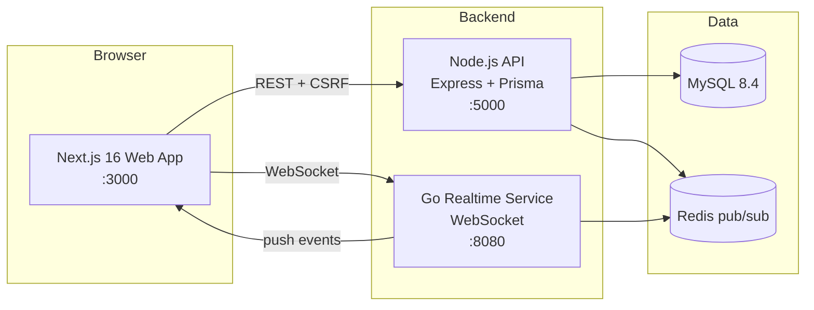

# MindEase — Mental Health Consultation Platform

A production-grade mental health platform connecting patients with psychologists: appointment booking, mood tracking, AI-assisted pre-session preparation, real-time chat, and an admin console.

## Architecture



- **Web**: Next.js 16 (App Router), React 19, TanStack Query, Tailwind, next-intl (EN/ID), dark mode
- **API**: Express 5 + TypeScript, Prisma ORM, Zod validation, JWT rotation, CSRF, rate limiting, audit logs, pino logging, health checks
- **Realtime**: Go microservice (`server-realtime/`) — WebSocket hub consuming Redis pub/sub events pushed by the API (live notifications & chat)
- **Auth**: email/password (Argon2), Google SSO, email verification, TOTP 2FA, login lockout, refresh-token rotation
- **AI**: Gemini 2.0 Flash — pre-session questions, doctor briefings, wellness suggestions (with smart offline fallbacks)

## Quick start (local)

Prerequisites: Node 22+, MySQL 8, Redis, Go 1.26 (for realtime).

```bash
# 1. API
cd server
npm install
npm run db:push          # sync schema
npm run db:seed          # demo data
npm run dev              # http://localhost:5000

# 2. Realtime (Go)
cd server-realtime
go mod download
go run .                 # ws://localhost:8080/ws

# 3. Web
cd client
npm install
npm run dev              # http://localhost:3000
```

### Docker (full stack)

```bash
cp .env.example .env     # fill secrets
docker compose up --build
```

## Demo accounts (seeded)

| Role | Email | Password |
|---|---|---|
| Patient | `patient@mindease.app` | `Patient@123` |
| Doctor (8 available) | `dr1@mindease.app` … `dr8@mindease.app` | `Doctor@123` |
| Admin | `admin@mindease.app` | `Admin@123` |

## Environment reference

| Variable | Where | Purpose |
|---|---|---|
| `DATABASE_URL` | server/.env | MySQL connection |
| `JWT_SECRET` / `REFRESH_SECRET` | server/.env, client/.env.local, compose | Token signing (shared with realtime + middleware) |
| `GEMINI_API_KEY` | server/.env | AI features (falls back to local generation) |
| `GOOGLE_CLIENT_ID` | server/.env | Google SSO |
| `SMTP_HOST/PORT/USER/PASS` | server/.env | Reset/verification emails (dev: printed to console) |
| `REDIS_URL` | server/.env, compose | Realtime event bus |
| `NEXT_PUBLIC_API_URL` / `NEXT_PUBLIC_REALTIME_URL` | client | API + WS endpoints |

## Testing

```bash
# API — 38 integration tests (Vitest + Supertest)
cd server
npm run test:db          # prepare mindease_test database
npm test

# Realtime (Go)
cd server-realtime
go test ./...

# Web
cd client
npm run lint
npm run build
```

Coverage highlights: auth (lockout, rotation, CSRF, verification), booking (slot locking, idempotency, conflicts, reschedule), authorization matrix (IDOR), reviews (uniqueness, sanitization), wellness (streaks), TOTP 2FA.

## API documentation

Interactive Swagger UI: `GET /api/docs` — includes auth flows, booking lifecycle, AI endpoints, and the CSRF requirement.

## Key endpoints

| Area | Endpoints |
|---|---|
| Auth | `/api/auth/{register,login,refresh,logout}`, `/api/account/{forgot-password,reset-password,2fa/*}` |
| Doctors | `/api/doctors`, `/api/doctors/{id}`, `/api/doctors/slots/*` |
| Appointments | `/api/appointments/{book,my}`, `/{id}/{status,reschedule}` |
| Wellness | `/api/wellness/mood*`, `/api/ai/resources` |
| AI | `/api/ai/pre-session*`, `/api/ai/briefing*` |
| Messaging | `/api/messages/*` (REST) + WebSocket push |
| Admin | `/api/admin/{stats,users,audit-logs}` |
| System | `/api/health`, `/api/health/db`, `/api/csrf-token`, `/api/docs` |

## Security features

Argon2 hashing · HttpOnly cookie sessions with rotation · CSRF double-submit tokens · per-IP + per-account rate limiting · IDOR authorization checks · HTML sanitization · admin audit trail · GDPR account deletion · TOTP 2FA · email verification · JWT role claims enforced in middleware

## CI/CD

GitHub Actions (`.github/workflows/ci.yml`): server lint/typecheck/38 tests against a MySQL service container · client lint + build · Go build + tests · `docker compose build` on success.
