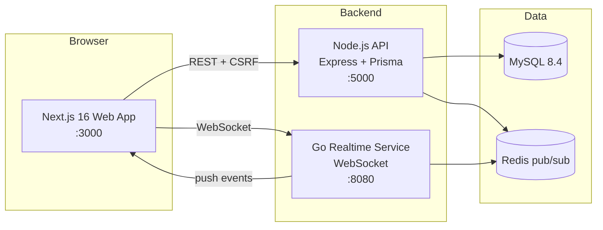

# MindEase — Mental Health Consultation Platform

A production-grade mental health platform connecting patients with psychologists: appointment booking, mood tracking, AI-assisted pre-session preparation, real-time chat, and an admin console.

## Architecture



- **Web**: Next.js 16 (App Router), React 19, TanStack Query, Tailwind, next-intl (EN/ID), dark mode
- **API**: Express 5 + TypeScript, Prisma ORM, Zod validation, JWT rotation, CSRF, rate limiting, audit logs, pino logging, health checks
- **Realtime**: Go microservice (`server-realtime/`) — WebSocket hub consuming Redis pub/sub events pushed by the API (live notifications & chat)
- **Auth**: email/password (Argon2), Google SSO, email verification, TOTP 2FA, login lockout, refresh-token rotation
- **AI**: Gemini 2.0 Flash — pre-session questions, doctor briefings (incl. PHQ-9/GAD-7 scores), wellness suggestions, journal reflections, natural-language doctor matching, support chat (with smart offline fallbacks)
- **Consultations**: in-app video/voice rooms (Jitsi embed) with participant-only access, open 15 min before the session, realtime join notifications, follow-up scheduling (doctors propose the next session), .ics calendar export
- **Screening**: PHQ-9 & GAD-7 self-assessments with severity scoring, tracked over time, printable PDF reports, surfaced in the doctor's AI briefing
- **Wellness**: mood logging with factor tags (sleep/exercise/social/work/stress) + factor correlation stats, private journal with AI weekly reflections, opt-in Monday email report, automated care check-ins (mood nudges, decline alerts, post-session check-ins)
- **Safety**: SOS panic button — one-tap alert to the patient's assigned doctor (notification + email + WhatsApp + realtime) with crisis hotlines
- **Support**: AI support assistant ("Ease") with crisis routing and human escalation; crisis hotlines page
- **Growth**: referral program (invite codes, credit on first completed session), therapy packages (multi-session bundles with package-linked bookings)
- **Notifications**: per-category × per-channel (in-app/email) preferences, web push (PWA) via VAPID
- **Trust**: doctor verification workflow (profiles hidden until admin approval), verified badges, doctor replies to reviews, admin review moderation (reports, hide), transactional emails + appointment reminders (email + optional WhatsApp), waitlist for full doctors, away mode

## Quick start (local)

Prerequisites: Node 22+, MySQL 8, Redis, Go 1.26 (for realtime).

```bash
# 1. API
cd server
npm install
npm run db:push          # sync schema
npm run db:seed          # demo data
npm run dev              # http://localhost:5000

# 2. Realtime (Go)
cd server-realtime
go mod download
go run .                 # ws://localhost:8080/ws

# 3. Web
cd client
npm install
npm run dev              # http://localhost:3000
```

### Docker (full stack)

```bash
cp .env.example .env     # fill secrets
docker compose up --build
```

## Demo accounts (seeded)

| Role | Email | Password |
|---|---|---|
| Patient | `patient@mindease.app` | `Patient@123` |
| Doctor (8 available) | `dr1@mindease.app` … `dr8@mindease.app` | `Doctor@123` |
| Admin | `admin@mindease.app` | `Admin@123` |

## Environment reference

| Variable | Where | Purpose |
|---|---|---|
| `DATABASE_URL` | server/.env | MySQL connection |
| `JWT_SECRET` | server/.env, client/.env.local, compose | Access tokens **and** WebSocket tickets |
| `REFRESH_SECRET` | server/.env | Refresh tokens (7d) — **must differ from `JWT_SECRET`** |
| `TWO_FACTOR_SECRET` | server/.env, compose | Pending 2FA tickets (5m) — **required in production**, must differ from `JWT_SECRET` |
| `GEMINI_API_KEY` | server/.env | AI features (falls back to local generation) |
| `GOOGLE_CLIENT_ID` | server/.env | Google SSO |
| `SMTP_HOST/PORT/USER/PASS` | server/.env | Reset/verification/booking/reminder emails (dev: printed to console) |
| `REDIS_URL` | server/.env, compose | Realtime event bus + caching (silently disabled when down) |
| `WA_GATEWAY_URL` / `WA_GATEWAY_TOKEN` | server/.env | Optional WhatsApp appointment reminders (graceful fallback when unset) |
| `PAYMENT_PROVIDER` / `PAYMENT_SERVER_KEY` | server/.env | Package checkout. Unset → in-process simulator (refused in production) |
| `VAPID_PUBLIC_KEY` / `VAPID_PRIVATE_KEY` | server/.env | Optional web push (PWA notifications; no-op when unset) |
| `CORS_ORIGINS` / `FRONTEND_URL` | server/.env | Allowed browser origins (defaults to localhost:3000) |
| `S3_ENDPOINT/BUCKET/REGION/ACCESS_KEY/SECRET_KEY/PUBLIC_URL` | server/.env | Avatar storage (S3-compatible; local disk fallback in dev) |
| `SENTRY_DSN` | server/.env | Error tracking (no-op when unset) |
| `NEXT_PUBLIC_API_URL` / `NEXT_PUBLIC_REALTIME_URL` | client | API + WS endpoints |
| `NEXT_PUBLIC_GOOGLE_CLIENT_ID` | client | Google SSO button (hidden when unset) |
| `NEXT_PUBLIC_SITE_URL` | client | Canonical site URL for SEO/OG metadata |
| `NEXT_PUBLIC_SENTRY_DSN` | client | Client error tracking |

## Deploying to production (Railway + Vercel)

**Web (Vercel)**: import `client/` — framework preset Next.js. Set env: `JWT_SECRET` (must equal the API's), `NEXT_PUBLIC_API_URL`, `NEXT_PUBLIC_REALTIME_URL`, `NEXT_PUBLIC_GOOGLE_CLIENT_ID`, `NEXT_PUBLIC_SITE_URL`.

**API + realtime + MySQL + Redis (Railway)**:
1. Create projects from `server/` and `server-realtime/` (Dockerfiles included; `server/railway.json` runs migrations on start via `scripts/start.sh`).
2. Add Railway MySQL + Redis plugins.
3. API env: `DATABASE_URL`, `JWT_SECRET`, `REFRESH_SECRET`, `TWO_FACTOR_SECRET`, `GEMINI_API_KEY`, `GOOGLE_CLIENT_ID`, `REDIS_URL`, `CORS_ORIGINS=https://<vercel-domain>`, `FRONTEND_URL`, `S3_*` (see below), `SMTP_*`, `SENTRY_DSN` (optional).
4. Realtime env: `JWT_SECRET` (same value), `FRONTEND_URL`/`ALLOWED_ORIGINS` (comma-separated WebSocket origins), `REDIS_URL` (a `redis://` URL, not a bare `host:port`).

**Production checklist**
- [ ] Real SMTP configured (email flows fail loudly without it)
- [ ] Redis reachable (realtime push + cache active)
- [ ] S3-compatible storage configured (avatars persist across redeploys; Railway filesystem is ephemeral)
- [ ] Strong, unique `JWT_SECRET` / `REFRESH_SECRET` / `TWO_FACTOR_SECRET` — all three must differ (the server refuses to start in production if any is weak or if they collide, because a shared secret lets a credential minted for one flow verify as another)
- [ ] Google OAuth client configured with the production domain
- [ ] Backups: Railway MySQL plugin (managed backups) or `server/scripts/backup.ps1`
- [ ] Reminder job runs inside the API process — keep a single replica, or accept duplicate-email risk is handled via claim-then-send (safe with N replicas)

## Testing

```bash
# API — 38 integration tests (Vitest + Supertest)
cd server
npm run test:db          # prepare mindease_test database
npm test

# Realtime (Go)
cd server-realtime
go test ./...

# Web
cd client
npm run lint
npm run build
```

Coverage highlights: auth (lockout, rotation, CSRF, verification), booking (slot locking, idempotency, conflicts, reschedule), authorization matrix (IDOR), reviews (uniqueness, sanitization), wellness (streaks), TOTP 2FA.

## API documentation

Interactive Swagger UI: `GET /api/docs` — includes auth flows, booking lifecycle, AI endpoints, and the CSRF requirement.

## Key endpoints

| Area | Endpoints |
|---|---|
| Auth | `/api/auth/{register,login,google,refresh,logout}`, `/api/account/{forgot-password,reset-password,2fa/*,export,me}` |
| Doctors | `/api/doctors` (paginated, search), `/api/doctors/{id}`, `/api/doctors/slots/*`, `/api/doctors/patterns/*` (weekly availability + regenerate), `/api/doctors/analytics`, `/api/doctors/away`, `/api/doctors/packages/*` |
| Appointments | `/api/appointments/{book,my}`, `/{id}/{status,reschedule,join,ics,follow-up}`, `/{id}/rebook-options`, `/api/follow-ups/{id}/{accept,decline}` |
| Wellness | `/api/wellness/mood*`, `/api/wellness/journal*`, `/api/wellness/assessments*`, `/api/ai/resources` |
| AI | `/api/ai/pre-session*`, `/api/ai/briefing*`, `/api/ai/match-doctors` |
| Support | `/api/support/chat` (AI assistant with crisis routing), `/api/support/sos` (panic button) |
| Messaging | `/api/messages/*` (REST: thread, typing, attachments, delete, reactions) + WebSocket push (typing, read receipts, deleted/reacted) |
| Reviews | `/api/reviews`, `/api/reviews/doctor/{id}`, `/api/reviews/{id}/{reply,report}` |
| Growth | `/api/doctors/{id}/waitlist*`, `/api/packages/*` (purchase + my), `/api/doctors/packages/*` |
| Push | `/api/push/{public-key,subscribe,unsubscribe}` |
| Admin | `/api/admin/{stats,users,audit-logs,doctors/applications,broadcast,review-reports,reviews/:id/hide,export/:kind}` |
| System | `/api/health`, `/api/health/db`, `/api/csrf-token`, `/api/docs` |

## Security features

Argon2 hashing · HttpOnly cookie sessions with rotation · CSRF double-submit tokens · per-IP + per-account + per-endpoint rate limiting (auth, AI, support) · IDOR authorization checks · HTML sanitization · admin audit trail · GDPR account deletion + data export · TOTP 2FA · email verification · JWT role claims enforced in middleware · doctor verification workflow · WebSocket origin checks · fail-fast secret validation in production

## CI/CD

GitHub Actions (`.github/workflows/ci.yml`): server lint/typecheck/38 tests against a MySQL service container · client lint + build · Go build + tests · `docker compose build` on success.
