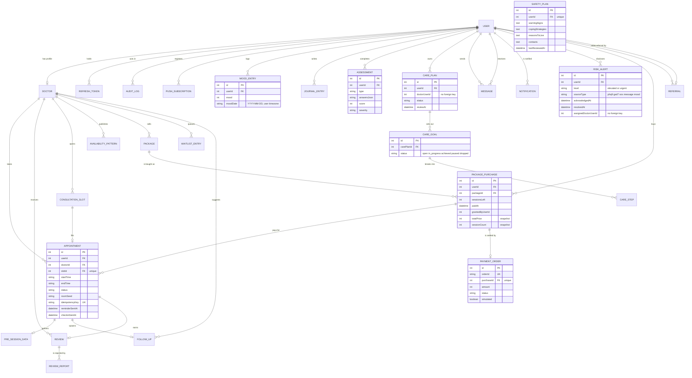

# Data model

28 tables, no enums, and almost every interesting decision in the schema is
recorded as a comment next to the column it justifies. This document is the map
of those decisions: what each group of tables is for, and why the ones that look
odd are shaped the way they are.

Source of truth is
[`server/prisma/schema.prisma`](../server/prisma/schema.prisma). Where this
document and the schema disagree, the schema is right.

For the process and layering picture see
[ARCHITECTURE.md](../ARCHITECTURE.md); for the decisions that produced the
current shape see [`adr/0003-payment-abstraction.md`](adr/0003-payment-abstraction.md)
and [`adr/0002-ai-provenance.md`](adr/0002-ai-provenance.md).

## Shape

Every foreign key cascades. That is a single decision, applied without
exception, and it is the reason the deletion strategy at the end of this
document has to be written the way it is.

Every status, level and type is a `String` with the legal values in a comment —
`Appointment.status`, `RiskAlert.level`, `Assessment.severity`,
`CareGoal.status` and the rest. There are no enums in the schema. The cost is
real and is paid in a specific place: `RiskAlert.level` cannot be ordered by the
database, so the triage sort happens in the service on a bounded page and the
resulting priority travels to the client as a number
(`riskQueue.service.ts:51`). The benefit is that adding a value is a data change
rather than a migration, which is the right trade for values that get added
often (`sourceType` has five and counting).

## Identity and accountability

`User`, `RefreshToken`, `AuditLog`, `PushSubscription`.

**One row per human; three roles as a `String`.** `User.role` is
`patient | doctor | admin`, defaulted to `patient`. A clinician is a `User` with
a related `Doctor` row — the `doctorProfile` relation is the 1:0..1 side, so
`Doctor.userId` is unique and the profile is created with the account rather
than by a later application. That is what makes "role" the only thing the
session layer has to carry.

**Separate OTP slots for password reset and email verification.** `User` carries
two independent pairs, `resetOtp*` and `verifyOtp*`, each with its own hash,
expiry and attempt counter. Sharing one slot let a verification request silently
invalidate an in-flight password reset, and let a code obtained through one flow
be spent on the other.

**`lastTotpStep` is an `Int`, not a `BigInt`.** It is the highest accepted
30-second TOTP step, which is seconds-since-epoch divided by 30 — comfortably
inside `Int` range, and an `Int` cannot surprise a JSON serializer.

**`PushSubscription` is unique on `(userId, endpoint)`, not on endpoint alone.**
A globally unique endpoint with an upsert that never wrote `userId` let a second
user on a shared device overwrite the first user's key pair, silently breaking
their notifications. Browsers also rotate keys for an unchanged endpoint, which
the per-user key absorbs in place.

**`AuditLog.actorId` is nullable with `onDelete: SetNull`, not a hard
relationship.** This is the pattern for every actor reference in the schema —
`AuditLog.actorId`, `RiskAlert.acknowledgedById`, `resolvedById`,
`notifiedDoctorUserId`, `assignedDoctorUserId`, `PackagePurchase.grantedByUserId`,
`CarePlan.doctorUserId`. The reason is in
[`20260927000000_clinical_continuity/migration.sql`](../server/prisma/migrations/20260927000000_clinical_continuity/migration.sql)
and it is worth restating because it looks like an oversight and is not:

> actor references must outlive the actor: an account deletion anonymises the
> user rather than removing the row, and a real FK would either block that or
> cascade away the clinical record.

So the decision is: **referential integrity is enforced by the service for actor
references, and by the database for everything else.** `CarePlan.userId` *is* a
foreign key with `onDelete: Cascade` — and its absence from that migration was
caught by the drift gate and corrected, which is a useful illustration of the
difference between the two classes.

`AuditLog` has no `onDelete` cascade anywhere, which is the point: an audit
trail that vanishes with its subject is not an audit trail.

## The clinician directory

`Doctor`, `Review`, `ReviewReport`.

**`Doctor.rating` defaults to `0`, not `5.0`.** This is the single most
defended default in the schema:

> a clinician with no reviews yet must not be presented to patients as a
> perfect 5.0, which is a false clinical claim.

`totalReviews` is denormalised alongside it and kept in step by
`ReviewService.recalcDoctorRating`. It was previously a fabricated 4.2–4.9 for
every seeded clinician with zero reviews, which also made the "Top Rated" sort
rank the most-liked-looking profiles first. `scripts/seed.ts` deliberately leaves
both at their defaults for the same reason.

`rating` and `totalReviews` are a cached aggregate rather than a view because
the directory sorts and filters on them on every page and there are indexes
built for exactly that (`(verificationStatus, rating)`,
`(specialty, price)`, `(experience)`, `(verificationStatus, awayUntil)`).

**`Review.appointmentId` is unique.** One review per completed session, and a
review cannot be attached to a session that did not happen.

**`Review.hidden`** is a boolean rather than a moderation status string, which
is the one place a status would have been overkill.

## Scheduling

`Appointment`, `ConsultationSlot`, `AvailabilityPattern`, `FollowUp`,
`WaitlistEntry`.

**`Appointment.roomSeed` exists so two people who join independently land in the
same room.** The room name is `mindease-{appointmentId}-{roomSeed}`. The random
component is generated once, persisted on the appointment row, and reused for
the life of that appointment — so a patient who joins from a phone and a
clinician who joins from a clinic arrive at the same name without coordinating.
It is created when the appointment is confirmed and **cleared on reschedule**
(`appointment.service.ts:705`), because a new slot is a new session and must not
inherit the old room. Including it also stops two deployments sharing a LiveKit
project from producing colliding room names, and means the name is not derivable
from the appointment id alone.

**`Appointment.slotId` is unique.** One appointment per slot, enforced by the
database rather than by a check-then-write in `bookAppointment`.

**Date and time are stored as two columns.** `appointmentDate` is a `DateTime`
at local midnight and `startTime` / `endTime` are `String` `"HH:mm"`. The
alternative — a single `DateTime` start plus a duration — makes "what time is
this in the clinic's timezone" a conversion every time it is read, and the
reminder job needs exactly that (`reminders.ts:13` rebuilds the instant with
`setHours` on the stored date).

**`idempotencyKey` is unique and optional**, accepted from the client on
`POST /api/appointments/book` and checked before creating. It is the answer the
payment checkout does *not* yet use; see
[`adr/0003`](adr/0003-payment-abstraction.md) and
[`roadmap.md`](roadmap.md).

**`reminderSentAt` and `checkinSentAt` are claim columns, not sent-at
timestamps.** The cron jobs write them with a conditional `updateMany` so
exactly one replica wins. The claim is taken *after* the eligibility check, and
the ordering is load-bearing — see [`operations.md`](operations.md).

**`ConsultationSlot` has a unique key on `(doctorId, date, startTime, endTime)`.**
Two concurrent "create slot" requests can both pass an application-level overlap
check; this makes an exact duplicate a database error instead. `isBooked` stays
as a denormalised flag alongside it.

**`AvailabilityPattern` is weekly recurrence, keyed on `weekday` (0 = Monday).**
`activeFrom` / `activeUntil` bound how long a pattern is live without deleting
its history.

**`WaitlistEntry` is unique on `(doctorId, patientId)` with no `status` in the
key.** The previous key included `status`, which permitted `waiting` and
`notified` rows to coexist for the same pair — so re-joining after a
notification produced two notifications when the slot opened.

**`FollowUp` has no index on `status`,** and that is deliberate: follow-ups are
only ever fetched by `appointmentId` or `id`, so indexing `status` was write
amplification on a hot table for no read. `doctorId` *is* indexed and cannot
otherwise be — MySQL requires an index backing a foreign key and rejects the
`ALTER` without one. That is stated in the schema comment rather than left for a
reader to work out.

## The patient's own record

`MoodEntry`, `JournalEntry`, `Assessment`, `PreSessionData`.

**`MoodEntry.moodDate` is a `VarChar(10)` "YYYY-MM-DD" in the user's own
timezone, with a unique key on `(userId, moodDate)`.** This makes "one mood log
per day" a database invariant rather than a check-then-create race. The
alternative — a `DateTime` at local midnight — collides for anyone who travels or
whose server timezone differs from theirs.

**`PreSessionData.briefingSource` exists because a provenance flag on the HTTP
response is lost too early.** A clinical briefing is read asynchronously,
sometimes days after it was written. Storing the origin next to the text is what
lets a clinician reading a cached briefing still see that it was a deterministic
platform summary rather than a model's synthesis. It defaults to `"model"`
because every row written before the column existed was produced by a live
model. See [`adr/0002`](adr/0002-ai-provenance.md).

**JSON lives in `Text` columns throughout**, with a comment naming the shape:
`notificationPrefs`, `backupCodes`, `factors`, `answersJson`, `questionsJson`,
`SafetyPlan.contacts`. None of them is queried by any field within it, and
promoting any of them to a table would add a join to a read path that does not
need one. `SafetyPlan.contacts` states the rule outright: the list is read and
written as a unit and is bounded to a handful of people.

## Care continuity

`CarePlan`, `CareGoal`, `CareStep`, `SafetyPlan`.

**`CarePlan` is owned by the patient, not the clinician.** This is the
reversal, and the schema says so: a clinician can leave, and the patient's plan
should survive that. `doctorUserId` records who is currently responsible without
making them the author of everything in it. It is null while unassigned, because
a patient can start a plan before they have ever booked.

**`CarePlan` is a list per patient, not a single plan.** A plan closes and a new
one starts across a treatment episode, and the closed one is part of the history;
collapsing them would lose the only record of what was agreed earlier.

**`CareGoal.status` includes `dropped`.** A goal abandoned because it was wrong
or because the treatment changed has to stay distinguishable from one that was
met, or the plan reads as more successful than it was.

**`CareStep.done` is a boolean, not a status string.** The one place a `String`
would have been the wrong call — a step is either done or it is not, and
`doneAt` already carries the time.

**`SafetyPlan` is one row per patient (`userId` unique), and never generated.**

> The content is written by the patient or by their clinician together with them,
> and it is never generated. A support bot that offers to write someone's safety
> plan has misunderstood what the document is for: it is a thing a person may
> need to read alone, at the worst possible moment, and it has to be in their own
> words and about their own life.

One row rather than versions, because during a crisis the last thing anyone needs
is to choose the current version. `lastReviewedAt` is separate from `updatedAt`
on purpose: reviewing it *with* the patient is the point, and the timestamp is
how a clinician can tell a jointly-written plan from one nobody has looked at.

`professionalContact` is free text and deliberately not a foreign key to a
`Doctor` — "my therapist" is the useful answer, and a FK would go stale the
moment they leave.

`reasonsToLive` exists because it is the field a person most wants available and
least often volunteers, and a plan that only lists problems is a demoralising
document to read in a crisis.

## Communication

`Message`, `Notification`.

`Message` carries `deletedAt` (soft delete), `reaction`, `readAt` and a single
`attachmentUrl` / `attachmentType` pair. One attachment, not a table — the same
rule as the other JSON-in-text columns.

Six indexes on a two-column table is not over-engineering; each one exists
because of a specific query, and the comments name them. The heaviest is
`(senderId, receiverId, id)`: `getMessages` paginates on `id desc` with an
`id: { lt: before }` cursor, neither of the `createdAt`-ending indexes could
serve a keyset filter, and the client polls that endpoint **every 5 seconds per
open conversation**.

`Notification` has `(userId, createdAt, id)` purely for the `id` tiebreaker in
`orderBy: [{ createdAt: desc }, { id: desc }]`, polled every 15 seconds per user.

## Safety

`RiskAlert`.

The most opinionated model in the schema. Five decisions, each documented:

1. **A disclosure is a row, not a score.** PHQ-9 item 9 previously reduced to a
   numeric total and otherwise discarded, so the single most safety-critical
   response in the product produced no signal at all.
2. **`acknowledgedAt` and `resolvedAt` are different acts.** Acknowledged means
   a human has seen it; resolved means it is dealt with. An alert acknowledged on
   Monday and still owed an outcome on Friday used to look identical to one
   nobody had seen.
3. **`notifiedDoctorUserId` and `assignedDoctorUserId` are separate.** Several
   channels fire at once — in-app, email, realtime, WhatsApp, up to five admins —
   so "who was told" is often not a clinician at all. The queue has to be
   addressed to whoever is actually treating the patient, or an alert raised at
   23:00 lands in nobody's worklist.
4. **`resolutionNote` is optional.** Sometimes the right note is "spoke to them
   on the phone"; it is recorded rather than inferred.
5. **A resolved row stays in the table.** "We raised this and dealt with it" is
   the record a clinician needs when the patient returns.

Index order follows the queue query: `(assignedDoctorUserId, resolvedAt,
createdAt)` leads with `resolvedAt` because an unresolved alert is what a
clinician opens the page for.

`level` is a `String`, which is the cost of the no-enums rule: the sort happens
in `RiskQueueService.listQueue` on a bounded page of 200 rows and the computed
priority is returned as a number rather than a string the client re-sorts.

## Money and growth

`Package`, `PackagePurchase`, `PaymentOrder`, `Referral`.

**The `paidAt` invariant.** An entitlement is legitimate if it has a verified
`paidAt`, **or** an explicit `grantedByUserId` from an administrator. Nothing
else grants sessions. One column carries the entire security model of the
subsystem, and it is a column rather than a state machine because the thing that
must not be forgeable is the provider's own confirmation. Full argument in
[`adr/0003`](adr/0003-payment-abstraction.md).

**Price is snapshotted.** `PackagePurchase` carries `totalPrice` and
`sessionCount` as copies, so a clinician re-pricing a package cannot silently
change what an existing customer paid or how many sessions they are owed — and
so a callback's amount can be re-checked against what was actually ordered.

**`PaymentOrder` holds the `orderId` → purchase mapping explicitly.** The provider
is told an `orderId` before the patient is redirected and the same id comes back
on the callback. Overloading a purchase column would make the callback a scan; a
separate table makes it one indexed lookup. `simulated` is a boolean on the
order rather than an inference from a naming convention, so it is always possible
to tell afterwards which entitlements were granted without money.

**`Referral.referredId` is unique** — one referrer per referred account, so a
code cannot be claimed twice. `status` is `pending | credited`.

## Indexes are part of the design

A migration whose only content is indexes:
[`20260930000000_query_support_indexes`](../server/prisma/migrations/20260930000000_query_support_indexes/migration.sql).
It was produced by reading every `where` and `orderBy` in the codebase against
the datamodel, and every index it adds is annotated with the query it serves.

The general rule the comments follow: **lead with the equality column.** The
clearest example is `(status, reminderSentAt, appointmentDate)` replacing
`(reminderSentAt, appointmentDate, status)`. Leading with the nullable
`*SentAt` column puts every unsent row in a single `NULL` block that MySQL must
scan and filter, so `appointmentDate` can never be used as a range.

## Deletion: anonymise, do not remove

`AccountService.deleteAccount` (`account.service.ts:190`) is the opposite of what
the name suggests. The `User` row survives. What is removed is the person.

### Why

Three reasons, in order of weight.

**A clinician deleting their account used to delete their patients' treatment
records.** Seven relations cascade from `Doctor`. The `Doctor` profile is
therefore *anonymised, never deleted*: `bio`, `education`, `languages`, the bank
details and the licence number are cleared, `availability` becomes
`"Unavailable"`, `verificationStatus` moves to `"removed"` so the directory
filter never returns it, and `rating`/`totalReviews` are zeroed because there is
no longer anyone to rank. What remains is a tombstone that keeps every
appointment row referentially intact.

**A risk disclosure is clinically relevant to whoever treats the patient next.**
`RiskAlert` rows are deliberately *not* deleted. The `reason` is
system-generated ("PHQ-9 item 9 … answered 'several days'"), not
patient-authored prose, and the linked `User` is anonymised, so nothing
identifying survives. Erasing the row would quietly remove a safety signal from a
clinician's queue for someone who is no longer their patient.

**Identifiers are load-bearing for integrity, not identity.** The anonymised
email is `deleted-{16 hex chars}@deleted.invalid`, derived from a random source
rather than the row id — so the GDPR export never echoes the internal primary
key even in its placeholder form.

### What is destroyed, and what is kept

| Destroyed | Retained |
|---|---|
| `JournalEntry`, `Assessment`, `MoodEntry` — the patient's own prose and scores | `Appointment` — cancelled, `notes` nulled |
| `Message` (both directions), `Notification` | `RiskAlert` — the disclosure record |
| `PreSessionData` — free-text answers **and** the AI briefing derived from them | `AuditLog` |
| `Review`, `WaitlistEntry`, `Referral`, `PackagePurchase` | `Doctor` — as a tombstone |
| `RefreshToken`, all OTPs, `totpSecret`, `backupCodes`, `googleId`, `password` | `ConsultationSlot`, `AvailabilityPattern` for a departing clinician — deleted, because they are pure scheduling capacity |
| `PushSubscription` | |
| `FollowUp` | |

Two entries in that table are not obvious and are worth calling out.

**`PreSessionData` is deleted even though appointments are retained.** The
comment is explicit: otherwise the assigned doctor keeps reading a deleted
patient's pre-session answers and the briefing synthesised from them. Retention
of the appointment is not retention of its contents.

**Scheduling and preference state is cleared, not just PII.**
`weeklyReportEnabled` goes false, `lastMoodNudgeAt` and `lastDeclineNudgeAt` go
null, `notificationPrefs` goes null. The weekly report and the care-check-in
crons both scan on those columns, so a deleted account that still had
`weeklyReportEnabled` would keep receiving a mental-health email at an address
that no longer belongs to them. `timezone` is cleared too — coarse location
data — which is safe because the day keys (`MoodEntry.moodDate`) were already
materialised when those rows were written.

`referralCode` is nulled specifically because it is a live lookup key: keeping it
would let a later account claim credit earned by a departed one.

### User-visible effect

The account stops existing from the user's point of view immediately —
`isBanned` is set, `provider` becomes `"deleted"`, and the old email and password
no longer authenticate anything. But the row is still there, its appointments
still appear on the clinician's schedule, and its risk disclosures still appear
in a risk queue. That is the intended behaviour and it is worth being able to
explain, because to a reader who has just read "delete my account" it looks like
the deletion did not work.

Nothing here removes the row, and no migration in this repository deletes a
clinical record. If a row must go, the reason is a clinical one and it belongs
in an ADR.