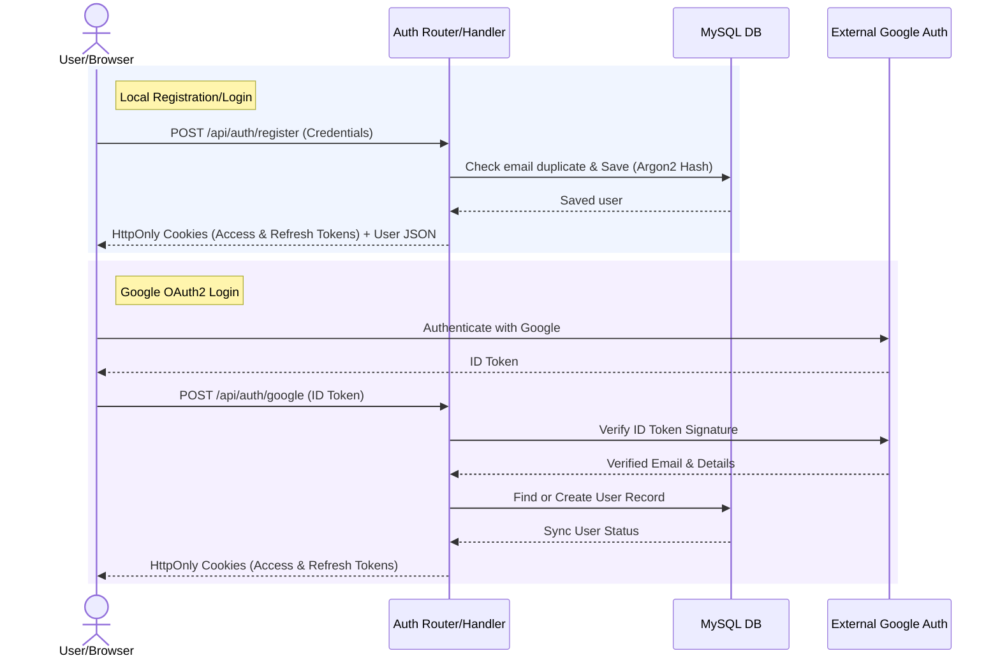
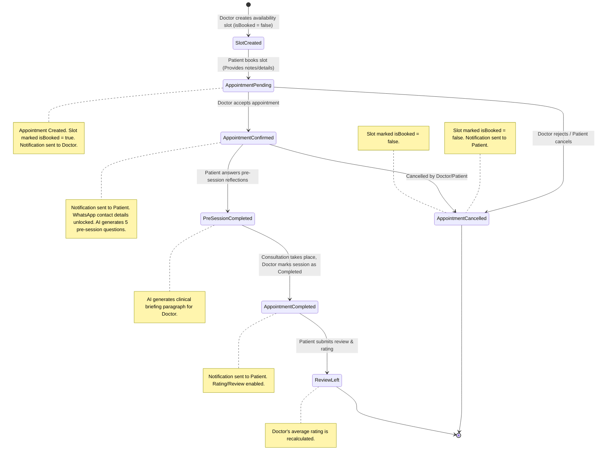
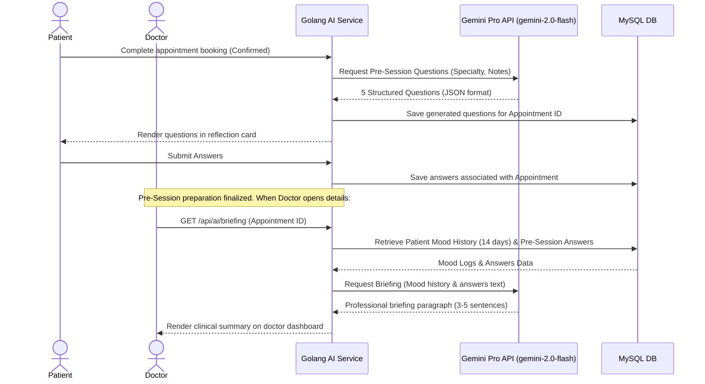

# Product Requirement Document (PRD): MindEase

## 1. Executive Summary & Product Vision
MindEase is a premium, secure mental health consultation platform connecting patients with specialized psychologists. The platform aims to demystify mental health support by offering automated, high-quality, clinical AI-augmented tools for pre-session preparation, doctor briefings, and self-guided wellness resources, in addition to booking clinical sessions. 

The product's vision is built on three core pillars:
1. **Low-Friction Clinical Matching**: Fast discovery of mental health professionals, structured scheduling, and seamless communication.
2. **AI-Empowered Sessions**: Elevating the quality of consultations using Gemini to collect structured patient reflections and provide doctors with summarized briefings.
3. **Continuous Wellness Touchpoints**: Continuous mood tracking and personalized suggestions to encourage user engagement between sessions.

---

## 2. User Roles & Permissions Matrix

The platform is designed with three distinct user roles:

| Feature / Capability | Patient (User) | Doctor (Specialist) | System Admin |
| :--- | :---: | :---: | :---: |
| Self-Registration & Local/Google Auth | Yes | Yes | No (Seed / Manual Promote) |
| Profile & Bio Management | Yes | Yes (Specialty, Price, Bio) | Yes (All Users) |
| Search & Filter Doctors | Yes | No | No |
| Define Consultation Availability Slots | No | Yes | No |
| Book Appointments (Pending State) | Yes | No | No |
| Approve / Reject Bookings | No | Yes | No |
| Cancel Bookings | Yes | Yes | Yes |
| Launch Web/WhatsApp Consultation | Yes | Yes | No |
| Write Doctor Review & Rating | Yes | No | No |
| Log Daily Mood & View History/Stats | Yes | No | No |
| View Patient Moods & Pre-Session Answers | No | Yes (Only for booked patients) | No |
| View AI Pre-Session Clinical Briefing | No | Yes (Only for booked patients) | No |
| Receive Real-Time Notifications | Yes | Yes | Yes |
| Access Global System Health & Revenue Stats | No | No | Yes |

---

## 3. Epics & Feature Requirements

### Epic 1: Authentication & Account Management
#### Feature 1.1: Multi-Provider Authentication
- **Description**: Users can sign up and log in using email/password or Google Single Sign-On (SSO).
- **Requirements**:
  - Email signups must enforce high password complexity (minimum 8 chars, containing 1 uppercase letter, 1 number, and 1 special character).
  - Google accounts must verify OAuth2 identity tokens securely. If a user previously registered locally, signing in with Google with the same email merges the identity.
  - Automatically create a basic user profile. If registering with `role === "doctor"`, initialize a blank Doctor profile page.

#### Feature 1.2: Session Security & Rotation
- **Description**: Secure session persistence with zero local exposure of long-lived secrets.
- **Requirements**:
  - Persistent logins are maintained via HttpOnly, Secure, Lax `refreshToken` cookies (7 days expiry).
  - Short-lived `accessToken` cookies (15 mins expiry) secure standard API requests.
  - Access token refresh requests delete the old refresh token in the database and issue a rotated token pair (Refresh Token Rotation) to prevent replay attacks.
  - Logouts invalidate the database refresh token and clear all authorization cookies.

#### Feature 1.3: Password Reset Flow
- **Description**: Users who forgot their password can reset it via email.
- **Requirements**:
  - Requesting a reset sends a secure, unique 6-digit OTP (valid for 10 minutes) via email.
  - Validating the OTP allows the user to set a new password.
  - Rate limiting strictly enforced (max 3 reset attempts per hour).

---

### Epic 2: Doctor Search & Discovery
#### Feature 2.1: Specialized Doctor Directory
- **Description**: Patients search for mental health practitioners.
- **Requirements**:
  - Search query matching doctor names or specialties (e.g., Clinical, Family, Trauma, Addiction).
  - Filtering by specialty tag, price range (under 100k, 100k-300k, over 300k), and minimum experience years.
  - Sorting options: Top Rated (average review rating descending), Lowest Price (price ascending), Highest Price (price descending), and Most Experienced (experience years descending).
  - Detail page for each doctor displaying biography, experience, rating summary, price, and public availability status.

---

### Epic 3: Availability & Slot Management
#### Feature 3.1: Doctor Availability Scheduling
- **Description**: Doctors manage calendar availability slots for consultation bookings.
- **Requirements**:
  - Doctors define hourly slots by choosing a date, start time, and end time.
  - Prevent slot overlaps.
  - Open slots are flagged as `isBooked = false`. Once booked, slots are locked (`isBooked = true`) and excluded from patient discovery.
  - Doctors can delete unbooked slots. Booked slots cannot be deleted.

---

### Epic 4: Appointment Booking & Lifecycle Management
#### Feature 4.1: Consultation Booking
- **Description**: Patients book open availability slots for virtual consultations.
- **Requirements**:
  - The booking flow guides patients through 4 steps: (1) Date Selection, (2) Time Slot Selection, (3) Details & Complaints Form, (4) Summary & Payment/Consultation Mode Selection.
  - Patients select a consultation mode: Video Call, Voice Call, or Text Chat.
  - When booked, the slot status changes to `isBooked = true` and a new Appointment is created in a `pending` status.
  - Trigger a system notification to the doctor.

#### Feature 4.2: Appointment State Transitions
- **Description**: Managing states: `pending` -> `confirmed`/`cancelled` -> `completed`.
- **Requirements**:
  - **Doctor Action**: Can accept a booking (transitions status to `confirmed`) or reject it (transitions status to `cancelled`).
  - **Patient Action**: Can cancel a booking (transitions status to `cancelled`) prior to confirmation or within a grace window.
  - **WhatsApp Sync**: Confirmed appointments display direct communication buttons redirecting to the counterpart's phone number on WhatsApp.
  - **Completion**: Following the consultation, the doctor marks the session as `completed`. This allows the patient to leave a review.
  - Every status change writes a log and issues user notifications.

---

### Epic 5: AI-Powered Clinical Support (Gemini Engine)
#### Feature 5.1: Patient Pre-Session Reflections
- **Description**: Patients reflect on their feelings prior to a session via AI-generated questions.
- **Requirements**:
  - When booking is confirmed, the AI model generates **5 compassionate, context-specific questions** based on the doctor's specialty and the patient's brief complaint.
  - The patient submits answers to these questions prior to the session.

#### Feature 5.2: Doctor Clinical Briefings
- **Description**: AI compiles patient data into a concise, professional briefing for the doctor.
- **Requirements**:
  - Consolidate: (1) Patient's recent 14-day mood entries, (2) Pre-session question responses.
  - Generate a professional 3-5 sentence paragraph summarizing:
    - Current emotional trends and streaks.
    - Key challenges highlighted by the patient.
    - Suggested diagnostic routes or clinical focus areas for the session.
  - Access is restricted exclusively to the assigned doctor.

#### Feature 5.3: Personalized Wellness Resource Suggestion
- **Description**: Patient dashboards suggest tailored activities based on mood history.
- **Requirements**:
  - Retrieve the patient's 14-day mood history.
  - AI suggests 3 personalized activities categorized as: `exercise`, `meditation`, `journaling`, `breathing`, `social`, or `creative`.
  - Provide a title and description detailing why it fits their current state.

---

### Epic 6: Wellness Tracker (Mood & Logs)
#### Feature 6.1: Daily Mood Logging
- **Description**: Patients log emotional states on a 1-5 scale.
- **Requirements**:
  - Logs capture: Mood score (1-5, representing very low to very high) and optional descriptive text notes.
  - Prevent multiple entries within a calendar day if desired, or track sequentially with timelines.

#### Feature 6.2: Mood Analytics & Streaks
- **Description**: Dynamic dashboards visualize emotional patterns.
- **Requirements**:
  - Calculate 30-day average mood.
  - Track "Log Streaks" (consecutive days of mood logging).
  - Calculate "Emotional Trend": Compares average mood in the first 15 days of the month against the latest 15 days, outputting `improving`, `stable`, or `declining`.

---

### Epic 7: Notification Center & Messaging
#### Feature 7.1: Alerts & Inbox
- **Description**: Centralized message delivery for key user actions.
- **Requirements**:
  - Save notifications in database under categories: `appointment`, `message`, `system`.
  - Expose API endpoints to retrieve notifications, retrieve unread counts, mark single alerts as read, and mark all alerts as read.
  - Render an indicator on the navbar dashboard showing unread notifications.

#### Feature 7.2: Patient-Doctor Chat (In-App Messaging Placeholder)
- **Description**: Secure text messaging channel for confirmed appointments.
- **Requirements**:
  - Real-time or polling-based message fetching for active appointments.
  - Only allowed between participants of a `confirmed` or `completed` appointment.
  - Admin/System can send broadcast messages here as well.

---

### Epic 8: Profile & File Management
#### Feature 8.1: Patient & Doctor Profiles
- **Description**: Users can update their basic info and avatars.
- **Requirements**:
  - Name, phone number, and avatar URL are editable.
  - Doctors can additionally edit their bio, specialty, and price.
  - Phone numbers are critical for the WhatsApp redirection feature and must be validated (E.164 format).

#### Feature 8.2: File Upload (Avatars & Documents)
- **Description**: Secure upload for user avatars and medical documents.
- **Requirements**:
  - Images must be validated (Max 2MB, formats: .jpg, .png, .jpeg).
  - Use cloud storage (AWS S3, Cloudinary) or local secure directories (e.g. `public/uploads`) mapped appropriately.

---

### Epic 9: Admin Dashboard & Audit
#### Feature 9.1: System Overview & Audit
- **Description**: Admin monitoring of site activity and user registries.
- **Requirements**:
  - Calculate system KPIs: Total Patient accounts, Total Doctor accounts, Successful (completed) bookings, and Estimated Total Revenue (sum of session fees of completed bookings).
  - System Users list: Paginated list displaying name, email, role, and registration dates.
  - Access strictly enforced using role-based routing and middleware.

---

## 4. Key User Workflows & System Flows

### Flow A: User Authentication & Onboarding

### Flow B: Appointment Booking & Status Transition Flow

### Flow C: AI Pre-Session & Clinical Briefing Pipeline

---

## 5. Non-Functional & Scalability Requirements

### 5.1. Security & Compliance
1. **Zero Trust Authorization (IDOR Protection)**:
   - Every read, update, or deletion of a resource must be explicitly checked against the authenticated user's ID.
   - Example: A patient requesting `GET /api/appointments/:id` must trigger database checks confirming `userId` equals the authenticated user's ID, or they are the doctor assigned to the appointment.
2. **Secure Key/ID Exposure Protection**:
   - Internal auto-increment database integer IDs (`BIGINT`) must **never** be exposed in public API routes or JSON payloads.
   - Use UUIDv7 for all external URL route parameters and JSON responses (e.g. `/api/appointments/018f7a83-b7ca-7650-8b1c-34ba7015cf01`).
3. **Data Protection at Rest & In-Transit**:
   - All credentials hashed using Argon2id.
   - Session tokens passed via HTTP-only, Secure cookies with `SameSite=Lax` or `SameSite=Strict`.
   - Implement CSRF headers verification for mutating methods.
   - API endpoints rate-limited strictly (e.g., 20 auth attempts / 15 mins, 100 general requests / minute / IP).
   - Sanitize input parameters against Cross-Site Scripting (XSS) and SQL Injection (use parameter binding in SQL queries).
4. **Data Privacy (GDPR principles)**:
   - Provide an endpoint for users to delete their account. This softly deletes or anonymizes their historical appointment data while fully purging their PII.

### 5.2. Performance & Scalability (Target: 1M+ Users)
1. **Database Query Efficiency**:
   - Explicit indexes on columns utilized in search, filters, or relations (e.g. `userId`, `doctorId`, `specialty`, `price`, `isBooked`, `appointmentDate`).
   - Paginate all list responses (e.g. users, notifications, list of appointments) using cursor-based or limit-offset pagination. No raw unpaginated queries allowed.
   - Zero N+1 query patterns. Eager-load relations in Go repositories.
2. **Asynchronous Processing**:
   - Offload heavy tasks (e.g. generating notifications, triggering external Webhooks, log syncing, AI processing) to a background queue system (using a queue library like Asynq in Go with Redis, or worker pools).
3. **Caching**:
   - Cache doctor profiles, reviews summaries, and static wellness resources to reduce database load.

### 5.3. Error Handling & UI Resilience
1. **Sanitized Error Responses**:
   - Never leak database stack traces, file system trees, or internal compilation errors to client payloads. Return clean, unified error JSON with precise HTTP status codes:
     - `400 Bad Request` for validation failures.
     - `401 Unauthorized` for invalid or missing tokens.
     - `403 Forbidden` for IDOR/authorization failures.
     - `404 Not Found` for missing resources.
     - `429 Too Many Requests` for rate-limit breaches.
     - `500 Internal Error` with generic sanitized messages.
2. **Frontend UI State Control**:
   - Enforce strict loading states (inputs and submit buttons disabled during API mutations to prevent duplicate form submissions).
   - Implement Error Boundaries to isolate rendering crashes.
   - Display success/error statuses via toast alerts.

### 5.4. Deployment Architecture
1. **Infrastructure**:
   - Dockerized containers for Go Backend and Next.js Frontend.
   - Managed MySQL 8 Database with automated backups.
   - Redis for Session State/Rate Limiting/Asynchronous Workers.
2. **CI/CD Pipeline**:
   - GitHub Actions running Go linter, Go tests (unit & integration), and Next.js build verification.
   - Automated deployment on successful merge to `main`.
